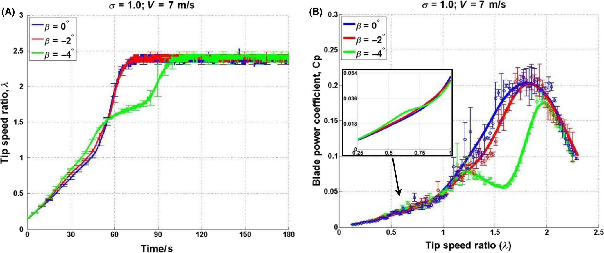

## Blade Pitch Angle

The `va15` study evaluates how small negative pitch angles affect startup and peak power in a 3-bladed H-Darrieus turbine. (source: sources/va15.md)

## Parameter

- The tested pitch angles are `beta = 0 degrees`, `beta = -2 degrees`, and `beta = -4 degrees`. (source: sources/va15.md)

Original caption: FIGURE 13 Blade pitch effects on turbine performance at sigma = 1.0 and V = 7 m/s. A, Self-starting, time-varying results. B, Cp ~ lambda curve [[va15|Source]]

## Outcome

- A small negative pitch (`beta = -2 degrees`) improves low-tip-speed-ratio performance and helps the turbine pass through the startup dead-band more easily. (source: sources/va15.md)
- Too much negative pitch (`beta = -4 degrees`) significantly degrades higher-`lambda` performance and can prevent effective startup at lower solidity. (source: sources/va15.md)

## Related

- [[Dynamic Stall]]
- [[Wind Turbine Parameters]]

#parameters
