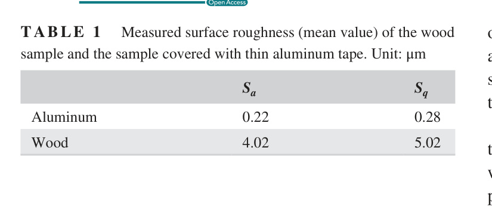

## Blade Surface Roughness

The `va15` study compares rough wooden blades against smoother blades covered with thin aluminum tape. (source: sources/va15.md)

## Parameter

- The roughness comparison uses original plywood blades and blades coated with 0.03 mm aluminum tape. (source: sources/va15.md)
- The measured wood surface roughness is much larger than the taped surface roughness. (source: sources/va15.md)

Original caption: TABLE 1 Measured surface roughness (mean value) of the wood sample and the sample covered with thin aluminum tape. Unit: micrometers [[va15|Source]]

## Outcome

- At higher solidity, rougher blades can improve low-`lambda` startup behavior by promoting earlier transition and delaying stall. (source: sources/va15.md)
- At higher tip-speed ratio, smoother blades perform better because of lower skin-friction drag. (source: sources/va15.md)
- At low solidity (`sigma = 0.67`), the rough blade failed to self-start while the smooth blade did self-start. (source: sources/va15.md)

## Related

- [[Dynamic Stall]]
- [[Wind Turbine Parameters]]

#parameters
