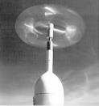

## Tip Speed Ratio Classification

The source uses tip speed ratio as a design/analysis parameter for distinguishing primarily drag-based vertical-axis turbines from aerodynamic lift-based designs. (source: sources/va3.md)

## Parameter

- Tip speed ratio is defined as rotor tip speed divided by wind speed. (source: sources/va3.md)
- For a cup anemometer, the source says the cups cannot go faster than the wind, so the tip speed ratio is less than or equal to 1. (source: sources/va3.md)
- The source states that α > 1 implies some amount of lift, while α < 1 means primarily drag. (source: sources/va3.md)
- It says aerodynamic lift-based designs can usually output much more power and do so more efficiently. (source: sources/va3.md)

## Outcome

- The parameter helps classify VAWT concepts into impulse/drag and lift/aerodynamic behavior. (source: sources/va3.md)
- The source uses this distinction to contrast low-efficiency drag machines with higher-efficiency aerodynamic designs. (source: sources/va3.md)
- For array design, the source later says counter-rotating VAWT arrays are most effective at TSR greater than 2 because turbine rotation can suppress vortex shedding and turbulence in the wake. (source: sources/va3.md)

## Related

- [[VAWT]]
- [[Darrieus Turbine]]
- [[Savonius Turbine]]
- [[va3 Counter-rotating Array Spacing]]

#parameters
