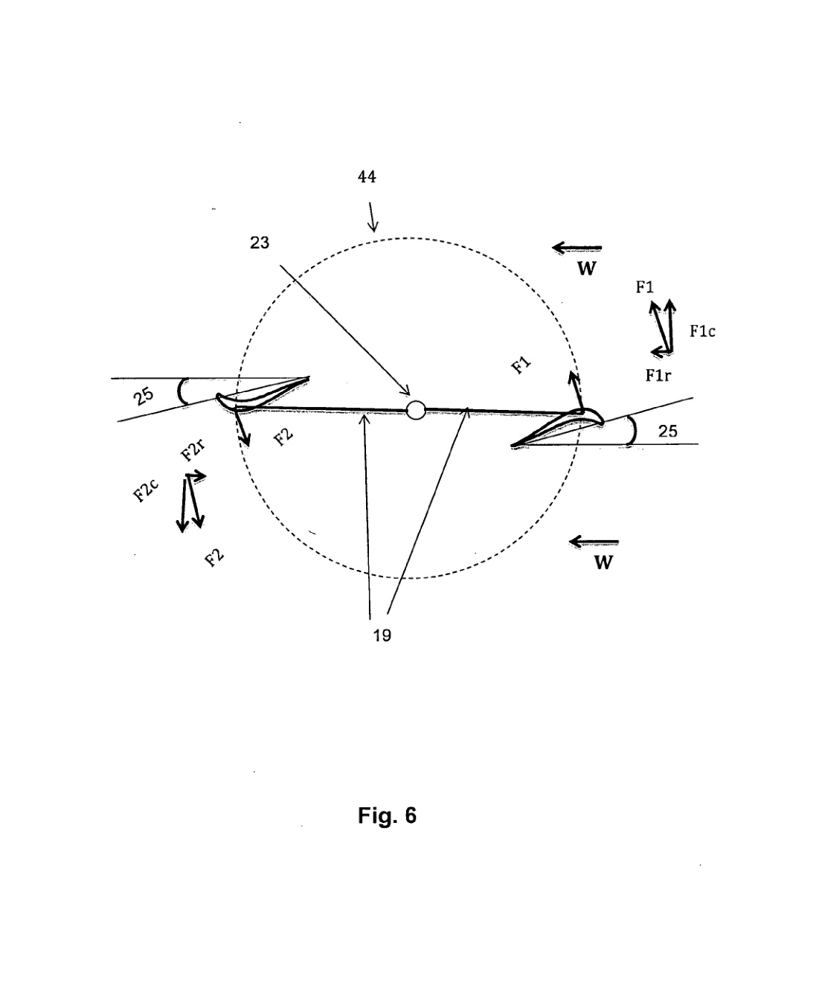

## Blade-to-Horizontal-Beam Angle

This `va8` patent fixes the angle between the blade chord and the horizontal support beam to control lift-force direction and torque generation. (source: sources/va8.md)

## Parameter Change

- The connection between the blade pin and the horizontal beam is fixed so the angle between the beam and the blade chord is 25 degrees. (source: sources/va8.md)
- The patent's wind-tunnel discussion identifies about 25 degrees angle of attack as the point of maximum lift coefficient for the disclosed profile. (source: sources/va8.md)

Original caption: Figure 6: Arrangement of two airfoil blade-profiles with respect to the connecting beams. [[va8|Source]]

Original caption: Figure 5: Relation between lift coefficient and angle of attack. [[va8|Source]]

## Outcome

- The source presents 25 degrees as the orientation that yields the highest torque-producing lift behavior for the disclosed profile. (source: sources/va8.md)
- The patent's lift-curve discussion says the disclosed profile reaches maximum lift at about `25 degrees` angle of attack, which is why the structural mounting angle is fixed at the same value. (source: sources/va8.md)
- The patent uses this fixed angle as part of the example showing improved circumferential force generation and higher startup torque. (source: sources/va8.md)
- The evidence here is still indirect: the source gives a profile-level lift argument and a worked turbine-force example, but not a full turbine angle sweep showing multiple beam-angle alternatives. (source: sources/va8.md)

#parameters
