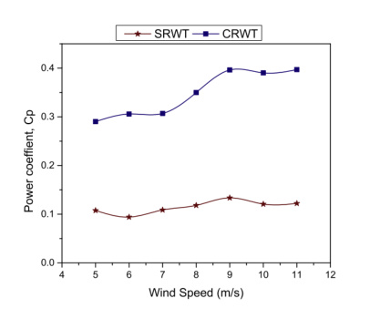

## Savonius Aspect Ratio

This `vj12` review discusses changing Savonius aspect ratio, defined as rotor height divided by rotor width, to influence power coefficient, RPM, and torque. (source: sources/vj12.md)

## Parameter Change

- The source summarizes studies covering a range of aspect ratios and notes reported optima near `0.7` and `0.77` for some Savonius cases. (source: sources/vj12.md)

Original caption: Figure 4: Savonius turbine with different aspect ratios [39]. [[vj12|Source]]

## Outcome

- The review says higher aspect ratio can slightly improve power coefficient, likely by reducing moment of inertia. (source: sources/vj12.md)
- It also says the absolute optimum remains undefined because structural and fatigue constraints limit how far the ratio can be pushed. (source: sources/vj12.md)

#parameters
