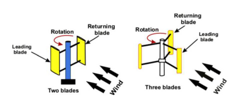

## Savonius Blade Count

This `vj12` review discusses changing the number of Savonius blades to alter torque characteristics and power output. (source: sources/vj12.md)

## Parameter Change

- The source compares two-bladed, three-bladed, four-bladed, and even six-bladed Savonius configurations across different studies. (source: sources/vj12.md)

Original caption: Figure 10: Savonius rotors with various blade numbers [62]. [Source](../../sources/vj12.md)

## Outcome

- The review says additional blades can improve torque characteristics and make output more stable. (source: sources/vj12.md)
- But most cited studies in the review report lower power coefficient as blade count increases, with two-bladed rotors often performing best in mechanical power or `Cp`. (source: sources/vj12.md)

#parameters
