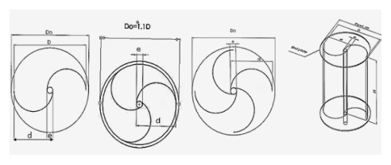

## Savonius Inner Blades

This `vj12` review discusses adding inner blades to a Savonius rotor to reduce negative torque and improve overall performance. (source: sources/vj12.md)

## Parameter Change

- The review covers one-inner-blade and two-inner-blade configurations as well as spacing changes between inner blades. (source: sources/vj12.md)

Original caption: Figure 11: (a) Conventional rotor, (b) Rotor with one inner blade, (c) Rotor with two inner blades [65]. [Source](../../sources/vj12.md)

## Outcome

- The review reports up to 41% improvement in power coefficient relative to a conventional rotor without inner blades. (source: sources/vj12.md)
- It also reports spacing-dependent gains, including about 33% improvement at a `0.005 m` gap in one cited study. (source: sources/vj12.md)

#parameters
