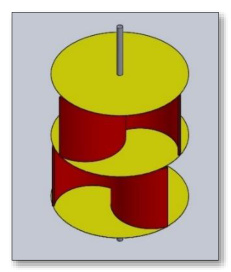

## Savonius Number of Stages

This `vj12` review discusses multi-staging, where similar Savonius units are stacked on one shaft to smooth torque fluctuations. (source: sources/vj12.md)

## Parameter Change

- The review covers single-stage, two-stage, and three-stage Savonius arrangements. (source: sources/vj12.md)

Original caption: Figure 8: Torque coefficient against TSR for single, two and three-stage Savonius rotors [55]. [[vj12|Source]]

## Outcome

- The review says multi-stage layouts can smooth torque fluctuations and stabilize static torque. (source: sources/vj12.md)
- However, the review reports mixed power results: one cited study says a one-stage rotor achieves about `20%` higher `Cp` than a two-stage rotor, while other studies argue that multi-stage layouts improve specific power or starting behavior. (source: sources/vj12.md)
- A cited two-stage versus three-stage comparison reports broadly similar dynamic performance, but better static torque for the three-stage case. (source: sources/vj12.md)
- The review suggests that disagreement across studies may be entangled with other design choices such as end plates and aspect ratio rather than stage count alone. (source: sources/vj12.md)

#parameters
