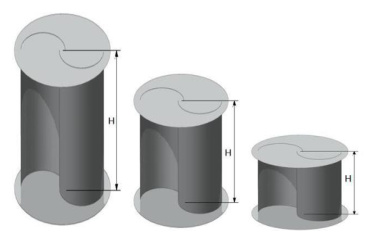

## Savonius Overlap Ratio

This `vj12` review discusses overlap ratio as a core Savonius parameter affecting startup, leakage flow, torque, and power coefficient. (source: sources/vj12.md)

## Parameter Change

- The source summarizes studies on no-overlap and overlapping rotors, with several reported favorable cases in the `0.1-0.15` range and others favoring null overlap. (source: sources/vj12.md)

Original caption: Figure 5: Scheme of a Savonius rotor: (a) without overlap; (b) with overlap [46]. [[vj12|Source]]

## Outcome

- The review reports mixed findings: overlap can improve startup and dynamic performance, but no-overlap cases can produce higher mechanical power in some studies. (source: sources/vj12.md)
- A commonly recommended range in the review is `0.1 to 0.15`, with `0.15` frequently cited as an effective value. (source: sources/vj12.md)

#parameters
