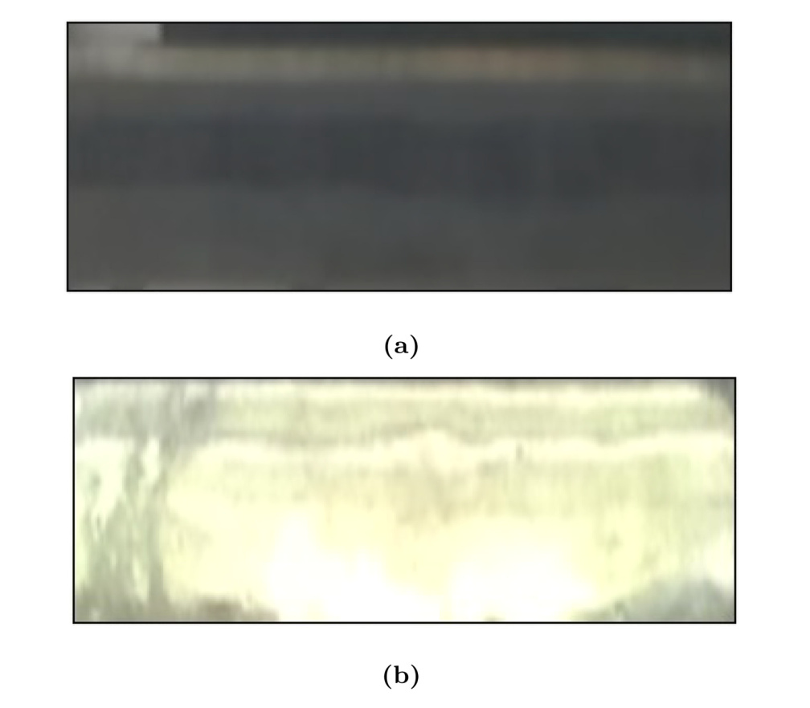
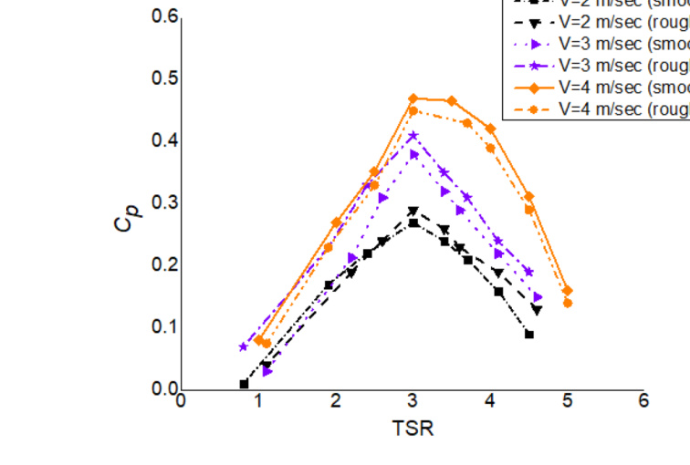

## Blade Surface Roughness

This `vj20` study directly compares rough and smoothed rotor-blade surfaces on the proposed hybrid VAWT to see how roughness changes low-Re performance. (source: sources/vj20.md)

## Parameter Change

- The as-manufactured blade surface was initially rough, with maximum roughness approximated as `0.4 mm`. (source: sources/vj20.md)
- The source reports a roughness-to-chord ratio of `0.008` before smoothing and `0.0004` after smoothing with fine-grid glass paper. (source: sources/vj20.md)
- The authors state that changes in dimensions and profile shape after smoothing were negligible. (source: sources/vj20.md)

Original caption: Figure 7. Comparison of rotor blade surface (a) rough surface and (b) smooth surface; the figure shows a significant difference for both the blades. [[vj20|Source]]

Original caption: Figure 8. Variation of Cp versus tip speed ratio (TSR) for rough and smooth surfaces at various wind speeds; the figure represents that for the wind speeds of 2 and 3 m/s, the rough surface has improved efficiency than the smooth surface. Above a wind speed of 3 m/s, the smooth surface resulted in more Cp at all TSR values. [[vj20|Source]]

## Outcome

- For wind speeds below `4 m/s`, the rough surface outperformed the smooth one in the reported tests. (source: sources/vj20.md)
- The source explains the low-speed gain by earlier transition from laminar to turbulent boundary layer and delayed stall at higher angle of attack. (source: sources/vj20.md)
- Above `3 m/s`, the smooth surface produced higher `Cp` at all tested TSR values, which the paper ties to reduced skin-friction drag at higher wind speed. (source: sources/vj20.md)

> Uncertainty: the paper says no suitable surface profiler was available, so the roughness values were approximated with a feeler gauge rather than measured with a higher-precision surface-metrology method. (source: sources/vj20.md)

#parameters
