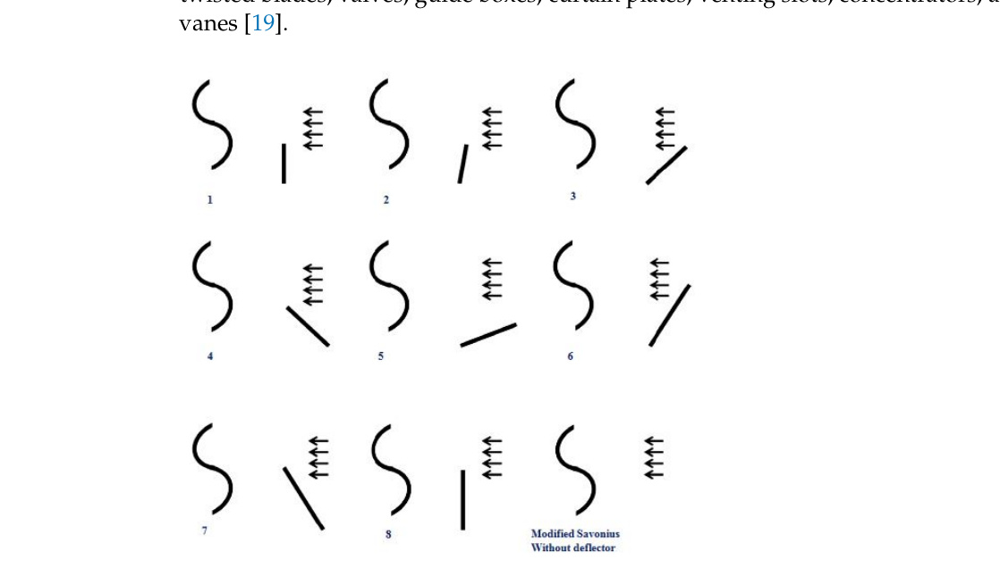

## Wind Deflector Position and Orientation

This `vj27` review emphasizes that the installation position and orientation of a wind deflector are as important as the deflector shape itself. (source: sources/vj27.md)

## Parameter

- The review says the main placement variables are upstream or downstream location, horizontal distance from the rotor, vertical distance relative to blade height, inclination angle, and deflector length. (source: sources/vj27.md)
- It explicitly warns that the wrong orientation can reduce performance below the no-deflector case. (source: sources/vj27.md)
- The review also says performance depends on whether the rotor is placed inside the near-wake region of the deflector or outside it. (source: sources/vj27.md)

Original caption: Figure 7. Various installation angles and positions of flat-plate deflectors (adapted from [20]). [[vj27|Source]]

Original caption: Figure 8. Power coefficient optimization of two-bladed and three-bladed Savonius turbine with flat-plate deflector (adapted from [77]). [[vj27|Source]]

## Outcome

- For the two-bladed Savonius case summarized in the review, the optimized flat-plate placement at `lambda = 0.7` is reported as `X1/R = -1.2383`, `Y1/R = -0.4539`, `X2/R = -1.0993`, with deflector angle `100.83 degrees`. (source: sources/vj27.md)
- For the three-bladed Savonius case, the optimized values are reported as `X1/R = -1.05632`, `Y1/R = -0.36912`, `X2/R = -1.38162`, with deflector angle `80.52 degrees`. (source: sources/vj27.md)
- In the helical/lift-based flat-plate case, the review reports best performance at `X = 2R`, `Y = 2/3 H`, deflector length `1.5H`, and parallel placement with no orientation angle, giving `47.10%` average torque-coefficient gain. (source: sources/vj27.md)
- In the twin-turbine kite-shaped case, the review says the best result occurred when the deflector was placed `0.7D` upstream of the rotor. (source: sources/vj27.md)
- The review therefore treats deflector placement as a strong optimization variable rather than a secondary mounting detail. (source: sources/vj27.md)

## Related

- [[Wind Deflector]]
- [[Optimization]]
- [[Savonius Turbine]]

#parameters
