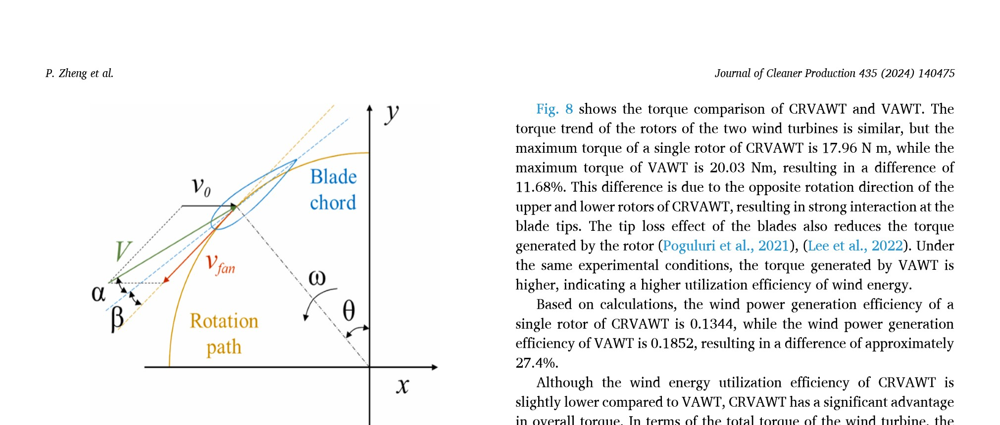

## Blade Pitch Angle

This `vj8` study varies the fixed blade pitch angle of the contra-rotating VAWT to improve aerodynamic performance. (source: sources/vj8.md)

## Parameter Change

- The source compares fixed pitch angles of `-3°`, `0°`, and `6°`. (source: sources/vj8.md)

Original caption: Fig. 9. Schematic diagram of the blade pitch angle. [Source](../../sources/vj8.md)

## Outcome

- The source reports that at `β = 0°`, the average power coefficients of the upper and lower rotors are 10.4% higher than at `-3°` and 17.5% higher than at `6°`. (source: sources/vj8.md)
- The response-surface optimum is `1.2°`, close to zero, to achieve higher pressure difference and rotor torque. (source: sources/vj8.md)

#parameters
