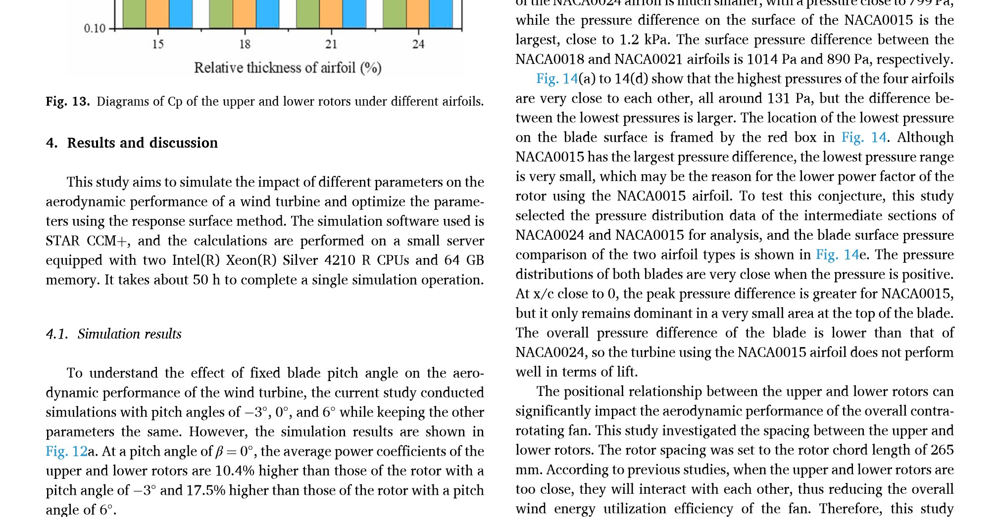

## Rotor Spacing

This `vj8` study changes the spacing between the upper and lower CRVAWT rotors to balance wind-energy recovery against offshore stability. (source: sources/vj8.md)

## Parameter Change

- The source analyzes spacing cases of 265 mm, 500 mm, 750 mm, and 1000 mm. (source: sources/vj8.md)

Original caption: Fig. 15. Simulation results and analysis of rotor spacing. [[vj8|Source]]

## Outcome

- The source says power coefficient increases as rotor spacing increases, because the CRVAWT gradually approaches isolated-VAWT behavior. (source: sources/vj8.md)
- At the smallest spacing, `265 mm`, stronger wake overlap reduces the recovery of the lower rotor and pushes the pair farther from isolated-turbine behavior. (source: sources/vj8.md)
- It also says excessive spacing raises the turbine center of gravity and hurts stability. (source: sources/vj8.md)
- The optimized spacing is `449.4 mm` as a balance between power and stability, so the optimum is not the largest-spacing Cp case but the best compromise between energy capture and offshore platform behavior. (source: sources/vj8.md)

#parameters
