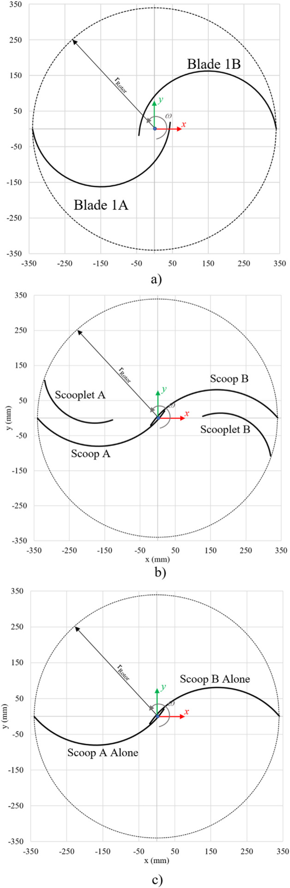

## Savonius Blade Shape

This `vj9` paper changes Savonius blade shape while keeping the design manufacturable with simple circular segments of constant thickness. (source: sources/vj9.md)

## Parameter Change

- The source compares the classical Savonius baseline, a modified classical Savonius, and a novel scooplet-based design. (source: sources/vj9.md)
- The optimization is centered on rotor-blade geometry rather than guide vanes or other external devices. (source: sources/vj9.md)
- The designs are compared at the paper's main design point of `TSR 0.9` and `12 m/s`. (source: sources/vj9.md)

Original caption: Figure 16. Torque coefficient curves for the proposed designs. [[vj9|Source]]

## Outcome

- The modified classical design improves power coefficient by 4.5% relative to the classical baseline. (source: sources/vj9.md)
- The scooplet-based design improves power coefficient by 39% relative to the classical baseline and exceeds the next-best Bach-type design by 27%. (source: sources/vj9.md)
- The paper explains the scooplet result by saying the new blade shape sustains positive torque over almost the full rotation while minimizing the negative-torque portions of the cycle. (source: sources/vj9.md)
- The source emphasizes that these gains are achieved with shapes that are still simple to manufacture from circular segments of constant thickness. (source: sources/vj9.md)

#parameters
