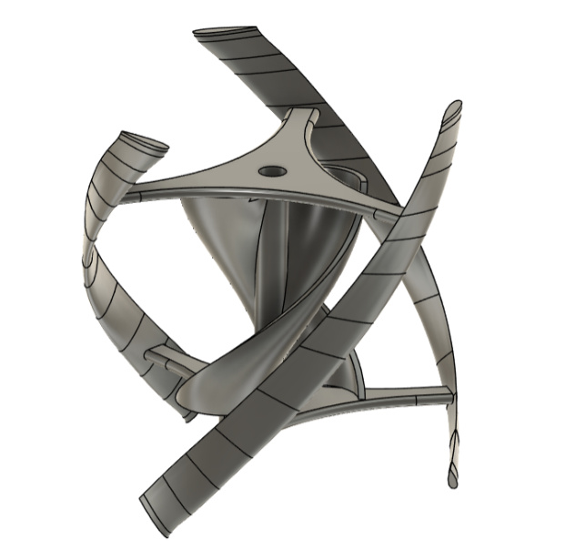
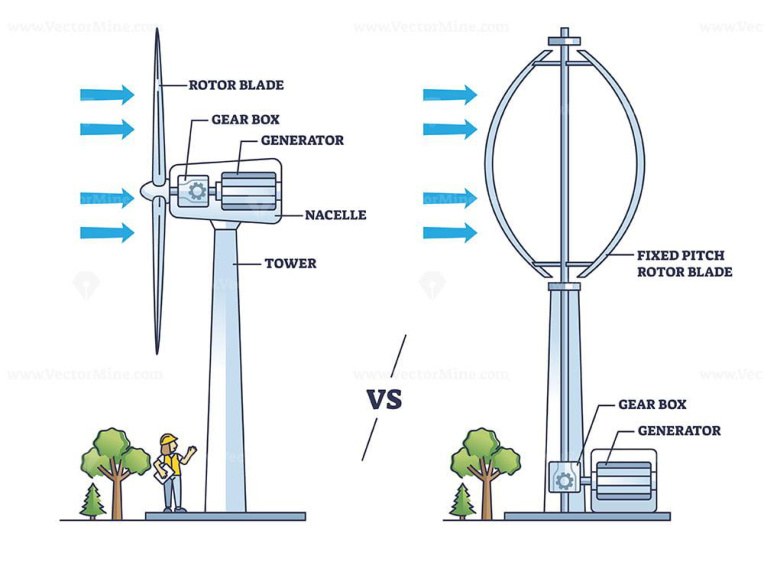

## HRI2526 Source Summary

Summary of `sources/HRI2526.md`. (source: sources/HRI2526.md)

Phase 1 project exploring rooftop VAWTs for urban energy generation.

Key points:
- Explored 200+ concepts, narrowed to 4 prototypes (source: sources/HRI2526.md)
- Selected helical hybrid (Darrieus + Savonius) design (source: sources/HRI2526.md)
- Used wind tunnel testing, CFD, and scaling analysis (source: sources/HRI2526.md)
- Found low economic viability in low-wind rooftop environments (source: sources/HRI2526.md)

Challenges identified:
- Low efficiency and power output (source: sources/HRI2526.md)
- Scaling mismatch between prototypes and real conditions (source: sources/HRI2526.md)
- CFD validation limitations (source: sources/HRI2526.md)

Recommendations:
- Improve testing setup
- Explore higher wind environments
- Develop higher-fidelity CFD / digital twin
(source: sources/HRI2526.md)
