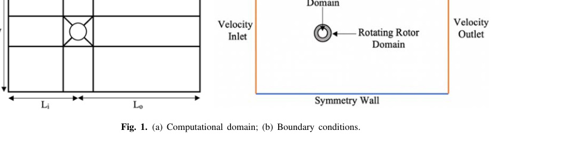
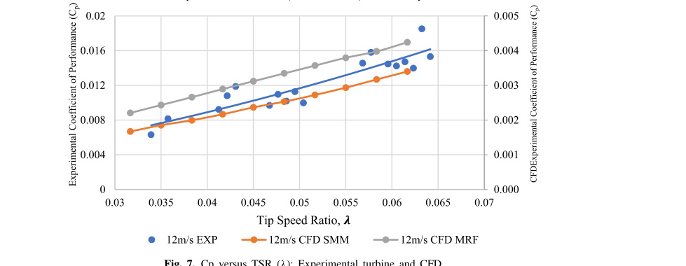

## cj1 Summary

This paper evaluates a three-bladed NACA 7715 Darrieus VAWT and a four-rotor planetary cluster using 2D transient ANSYS Fluent CFD, then compares a separate small isolated-rotor experiment with CFD. (source: sources/cj1.md)

- The CFD model uses pressure-based transient `k-omega SST`, sliding-mesh motion, a mesh-sensitivity analysis, torque sampled every time step, and a 45 m by 30 m domain. (source: sources/cj1.md)
- For the 3 m-diameter isolated rotor, the inlet is 5D upstream, the outlet is 10D downstream, and the domain width is 10D with symmetry boundaries. (source: sources/cj1.md)
- At 6 m/s, the central turbine’s best reported planetary case has `Cp = 0.3405` at TSR `1.5`; the isolated case peaks at `Cp = 0.3304` at TSR `1.25`. (source: sources/cj1.md)
- Of the tested angular arrangements, 30 degrees is the only case reported to increase central-rotor peak `Cp`; 0, 60, and 90 degrees reduce it. (source: sources/cj1.md)
- The planetary configuration improves the central turbine only above TSR `1.35` in the reported curve and not across every tested TSR. (source: sources/cj1.md)
- The isolated experimental model is a 200 mm-diameter, three-bladed NACA 7715 rotor. It uses a rotary torque sensor and averaged outlet-plane anemometer readings; it does not validate the planetary cluster itself. (source: sources/cj1.md)

Original caption: Fig. 1. (a) Computational domain; (b) Boundary conditions. [[cj1|Source]]

Original caption: Fig. 7. Cp versus TSR (lambda): Experimental turbine and CFD. [[cj1|Source]]

> Uncertainty: the paper reports a 2D model, while also noting that 2D CFD omits trailing vortices and tip losses. Its experiment validates only the isolated scaled turbine, and the paper contains inconsistent wording on the central peak improvement: 1.01%, 3.48%, and approximately 1% are each stated. The tabulated `Cp` values support an absolute increase of `0.0101` and a relative increase of about `3.1%` from `0.3304` to `0.3405`. (source: sources/cj1.md)

Related pages: [[CFD]], [[CFD and Validation]], [[cj1 CFD Modelling and Validation]]

#summaries
