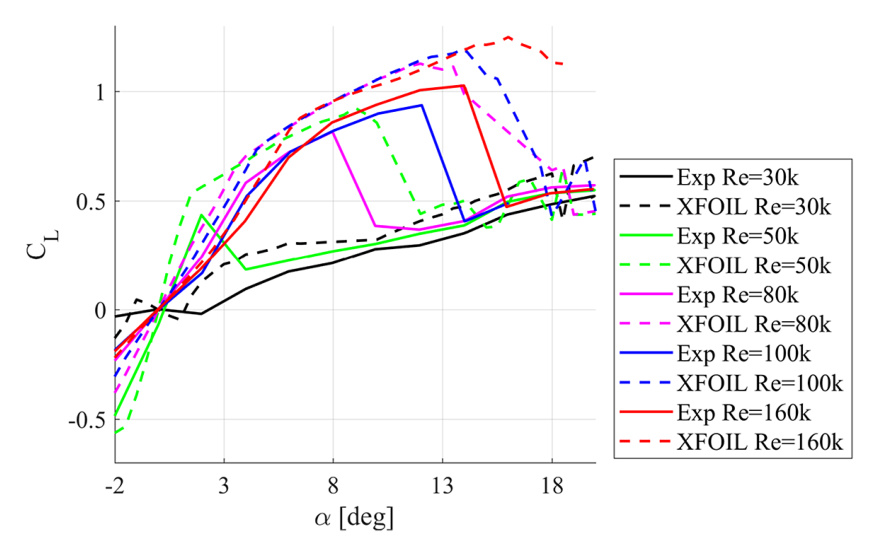

## cj9 Summary

Experimental and comparison study of the `NACA 0018` airfoil at very low Reynolds numbers, intended to provide airfoil data relevant to small-scale VAWTs and to compare experiment against `XFOIL` and `2-D` CFD. (source: sources/cj9.md)

- The study measures `NACA 0018` from `Re = 30,000` to `160,000` and from `-190` to `+20` degrees angle of attack in a low-turbulence wind tunnel, with drag reported only in the `-20` to `+20` degree range because of wake-rake width limits. (source: sources/cj9.md)
- It reports very strong Reynolds-number dependence: at `Re = 30k`, lift is nearly negligible and at `Re = 50k` the maximum lift coefficient is only `0.435` at `3` degrees, while at `Re = 100k` and `160k` the lift and drag behaviour is much stronger and highly nonlinear. (source: sources/cj9.md)
- The paper says `XFOIL` follows the general low-Re trends reasonably well but overestimates maximum lift, while the `2-D` Transition SST CFD result at `Re = 160k` underestimates lift but predicts the drag rise better than `XFOIL`. (source: sources/cj9.md)
- Two independent lift-measurement methods, wall pressure taps and a force gauge, agree strongly across most of the tested range, which the paper treats as confirmation that the low-Re data are reliable despite the difficult regime. (source: sources/cj9.md)

Original caption: Figure 13. Lift coefficient as a function of the angle of attack. Comparison of experimental results with XFOIL. [[cj9|Source]]

> Uncertainty: the study adds valuable low-Re `NACA0018` validation data, but it is still an isolated-airfoil case in a low-turbulence wind tunnel, not a full rotating-turbine validation. The paper itself notes that low-Re measurements and model calibration remain difficult. (source: sources/cj9.md)

Related pages: [[CFD]], [[CFD and Validation]], [[XFOIL]], [[cj9 NACA0018 Low-Re Validation Data]]

#summaries
