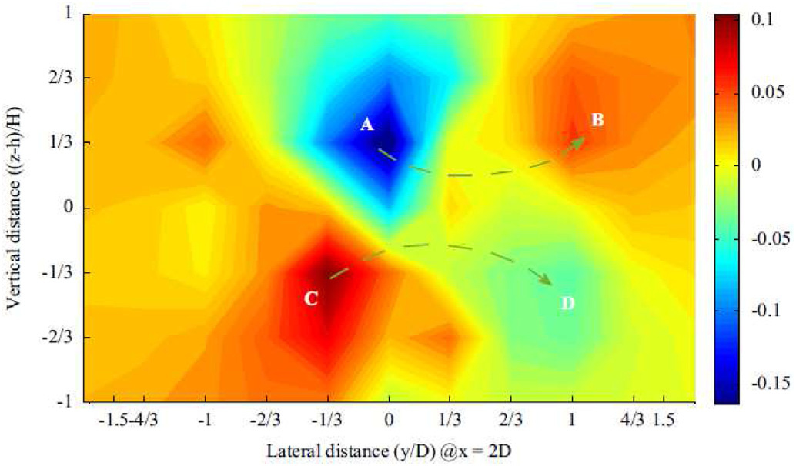
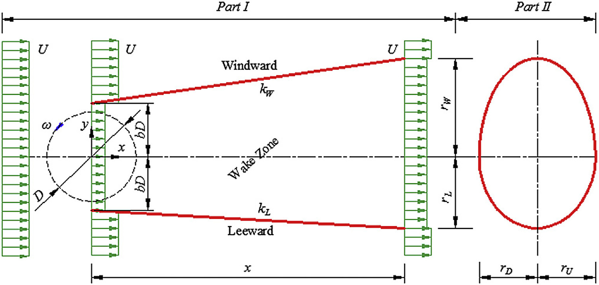

## va11 Summary

Review paper on the wake aerodynamics of H-rotor VAWTs, covering wake asymmetry, dynamic-stall-driven vortex shedding, experimental and CFD wake studies, and wake-model development for wind-farm layout design. (source: sources/va11.md)

Original caption: Fig. 9. Time-averaged vertical velocity contour in the y-z plane [*] [53]. [[va11|Source]]

Original caption: Fig. 38. Schematic of the wake model [78]. [[va11|Source]]

Key points:
- Treats H-rotor wakes as strongly asymmetric, with counter-rotating vortical motion and fast recovery driven by flow entrainment. (source: sources/va11.md)
- Describes the near wake as strongly shaped by dynamic stall and blade-wake interaction, while the farther wake is more suitable for analytical wake models. (source: sources/va11.md)
- Reviews wind tunnel testing, PIV, field tests, RANS, LES, DES, and analytical wake models as the main tools for studying VAWT wakes. (source: sources/va11.md)
- Connects wake understanding to turbine spacing and layout design, including compact twin and triangular array concepts and asymmetrical wake models for siting. (source: sources/va11.md)

Related concepts: [[H-rotor Wake Aerodynamics]], [[H-VAWT]], [[Dynamic Stall]], [[PIV Testing]], [[CFD]]

#summaries
