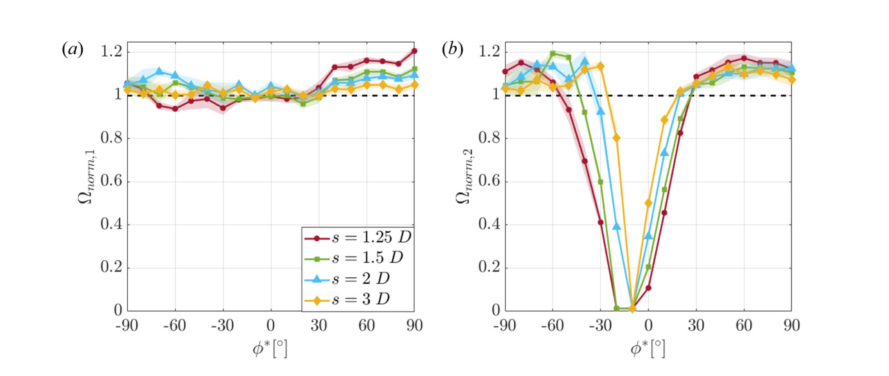

## va12 Summary

Primary experimental study of interacting VAWT pairs, linking array-angle, spacing, and rotational-orientation changes to performance and three-dimensional wake structure. (source: sources/va12.md)

Original caption: Figure 5. Normalized performance of (a) Turbine 1 and (b) Turbine 2 versus adjusted array angle (phi*) for turbine spacings of 1.25 D, 1.5 D, 2 D, and 3 D in a clockwise, co-rotating array. Error bands represent plus or minus one standard deviation from the mean measurement. [[va12|Source]]

Original caption: Figure 12. Three-dimensional isosurfaces of the time-averaged streamwise vorticity at the value omega_x = +/-Uo/D around: (a) clockwise co-rotating; (b) counter-clockwise co-rotating; (c) reverse doublet; and (d) doublet arrays. The arrays have a turbine spacing of s = 1.5 D and are at an array angle of phi = 50 degrees. Positive vorticity is red and negative vorticity is blue. The transparent cylinders represent the maximum extent of the rotor and the turbine tower. [[va12|Source]]

Key points:
- Reports paired-array performance changes for both upstream and downstream turbines, not just downstream wake effects. (source: sources/va12.md)
- Finds three main array-angle regimes: a wake-loss regime, a broad enhancement regime, and a regime where downstream enhancement can coexist with upstream loss. (source: sources/va12.md)
- Shows that downstream gains correlate with accelerated flow around the upstream rotor, while wake placement can arrest downstream rotation entirely in some cases. (source: sources/va12.md)
- Uses three-dimensional velocity measurements to show streamwise vortex interactions that can replenish wake momentum by mean advection from above and below the array. (source: sources/va12.md)
- Reports a robust co-rotating-pair case with about 14% average array-performance increase across roughly 40 to 90 degrees of adjusted array angle. (source: sources/va12.md)

Related concepts: [[H-rotor Wake Aerodynamics]], [[VAWT]], [[Wind Tunnel Testing]], [[3D Particle Tracking Velocimetry]]

#summaries
