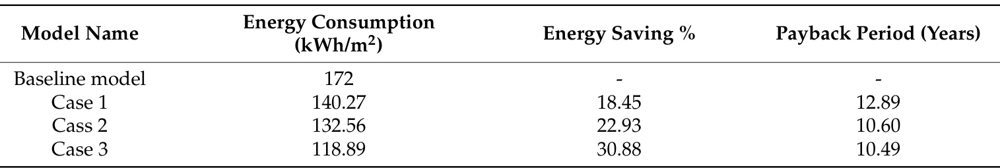

## va13 Summary

Primary study of three rooftop VAWT retrofit options on a residential building in Çe¸sme, Türkiye, comparing aerodynamic performance, building energy savings, and payback period. (source: sources/va13.md)

Original caption: Figure 6. Turbine designs for each case and rooftop installation (developed by authors). [[va13|Source]]

Original caption: Table 2. Simulation results for all cases. [[va13|Source]]

Key points:
- The study compares helical, IceWind, and combined helical-IceWind VAWT designs under a local average wind speed of about 7 m/s. (source: sources/va13.md)
- Reported single-turbine rated power outputs are 350 W for the helical case, 430 W for the IceWind case, and 590 W for the combined case. (source: sources/va13.md)
- On the modeled five-storey residential building, annual energy consumption dropped from 172 kWh/m2 to 140.27, 132.56, and 118.89 kWh/m2 for the three cases. (source: sources/va13.md)
- Reported energy savings are 18.45% for the helical case, 22.93% for the IceWind case, and 30.88% for the combined case. (source: sources/va13.md)
- Reported payback periods are 12.89 years, 10.60 years, and 10.49 years respectively, making the combined case the best performer in both savings and payback. (source: sources/va13.md)

Related concepts: [[Hybrid VAWT]], [[Economic Viability of VAWTs]], [[Urban Wind Conditions]], [[Payback Period Analysis]]

#summaries
