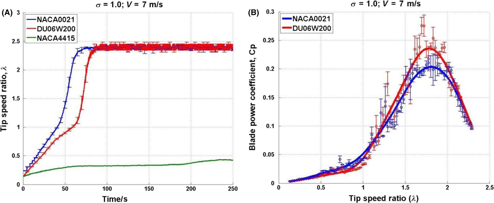
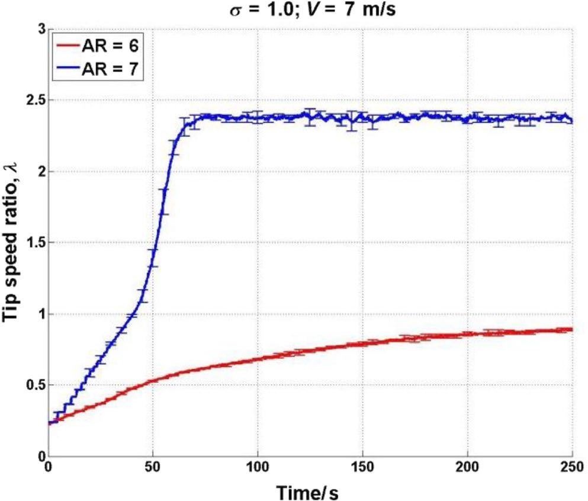

## va15 Summary

Primary experimental study of how solidity, blade profile, pitch angle, surface roughness, and aspect ratio affect self-starting and overall performance of a small-scale 3-bladed H-Darrieus VAWT. (source: sources/va15.md)

Original caption: FIGURE 10 Turbine performance with three different blade profiles at sigma = 1.0 and V = 7 m/s. A, Self-starting, time-varying results. B, Cp ~ lambda curve [[va15|Source]]

Original caption: FIGURE 20 Self-starting time-varying results for turbine with different blade aspect ratios at sigma = 1.0 [[va15|Source]]

Key points:
- Reports that high solidity (`sigma >= 0.81`) improves self-starting but reduces peak power output. (source: sources/va15.md)
- Finds that the thick symmetric NACA0021 profile gives better startup than the DU06W200 and NACA4415 profiles in this setup, and the NACA4415 cambered profile failed to self-start here. (source: sources/va15.md)
- Reports that a small negative pitch angle (`beta = -2 degrees`) improves low-tip-speed-ratio behavior, while too much negative pitch degrades overall performance. (source: sources/va15.md)
- Shows that increased blade surface roughness can help low-tip-speed-ratio starting at higher solidity, but may hurt performance at higher tip-speed ratio and can even prevent self-start at low solidity. (source: sources/va15.md)
- Shows that reducing blade span from 700 mm to 600 mm caused the tested turbine to fail to self-start, highlighting strong aspect-ratio sensitivity. (source: sources/va15.md)

Related concepts: [[H-VAWT]], [[Darrieus Turbine]], [[Wind Turbine Parameters]], [[Wind Tunnel Testing]]

#summaries
