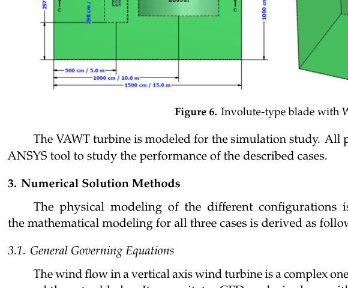
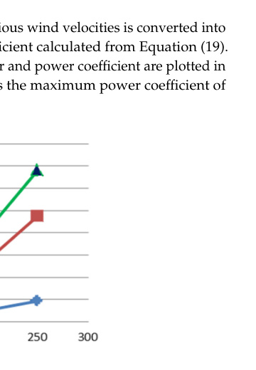

## va20 Summary

CFD study of three low-profile VAWT configurations for urban low-wind areas: a C-blade H-type rotor, an involute rotor, and an involute rotor augmented with a wind flow modifier. (source: sources/va20.md)

Original caption: Figure 6. Involute-type blade with WFM. [[va20|Source]]

Original caption: Figure 26. Electrical characteristics: (a) rotor power and (b) power coefficient. [[va20|Source]]

Key points:
- The paper compares a drag-driven `C-shaped` H-type rotor, a lift-driven involute rotor, and an involute rotor with a front-mounted wind flow modifier (`WFM`). (source: sources/va20.md)
- All three cases use a three-blade rotor with `0.96 m^2` swept area and are evaluated in ANSYS Fluent with a realizable `k-epsilon` turbulence model. (source: sources/va20.md)
- Reported maximum power coefficients at `5 m/s` are `0.071` for the C-blade rotor, `0.22` for the involute rotor, and `0.397` for the involute rotor with WFM. (source: sources/va20.md)
- The WFM increases diffuser-tube flow from about `1.822 m/s` at inlet to `5.562 m/s` at outlet, with a reported velocity magnification ratio of `3.05`. (source: sources/va20.md)
- At the top tested speed of `250 rpm` / `21 m/s`, reported turbine power reaches `188.9 W` for the C-blade case, `951.31 W` for the involute case, and `1361.4 W` for the WFM-assisted involute case. (source: sources/va20.md)

Related concepts: [[Wind Flow Modifier]], [[CFD]], [[Wind Turbine Parameters]], [[Urban Wind Conditions]]

#summaries
