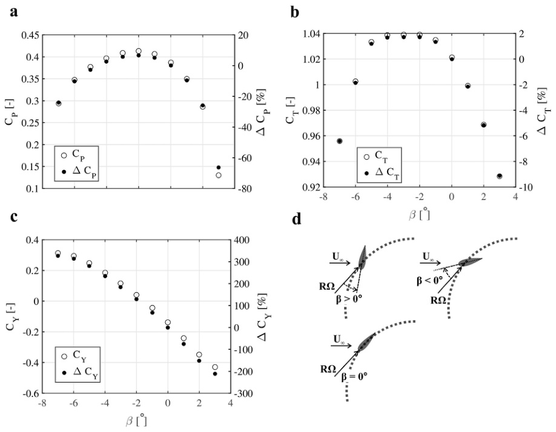
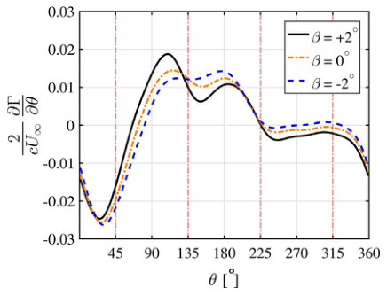

## va26 Summary

URANS CFD study of how fixed blade pitch changes the performance and blade aerodynamics of a low-solidity 3-bladed H-type VAWT at `TSR = 4`. (source: sources/va26.md)

Original caption: Fig. 13. Coefficients of (a) power, (b) thrust, (c) lateral force and their relative change to `b = 0` versus pitch angle for the last revolution. (d) A schematic showing a blade with positive pitch angle. [[va26|Source]]

Original caption: Fig. 22. Shed vorticity of one blade for the last revolution versus azimuth for `b = +2`, `0` and `-2` where `(+)` denotes counter-clockwise circulation based on the Kutta-Joukowski theorem [76]. [[va26|Source]]

Key points:
- The paper studies a `3`-bladed H-type VAWT with NACA0015 blades, `1 m` diameter, `1 m` height, solidity `0.172`, and operating `TSR = 4`. (source: sources/va26.md)
- The tested fixed pitch range is `-7` degrees to `+3` degrees, and the reported optimum is `-2` degrees. (source: sources/va26.md)
- At that optimum, the turbine `Cp` increases by about `6.6%` relative to zero pitch, while `CT` increases by about `2%`. (source: sources/va26.md)
- Positive pitch shifts blade loading toward the fore half of the revolution, while negative pitch benefits most of the rest of the cycle; this shift is the main reason the paper argues that dynamic pitching could improve performance further. (source: sources/va26.md)
- The source also reports that `+3` degrees causes deep stall and a severe power loss, with about `66.5%` lower `Cp` than zero pitch. (source: sources/va26.md)

Related concepts: [[H-VAWT]], [[Straight-bladed Darrieus]], [[Dynamic Stall]], [[CFD]], [[va26 Fixed Blade Pitch Angle]]

#summaries
