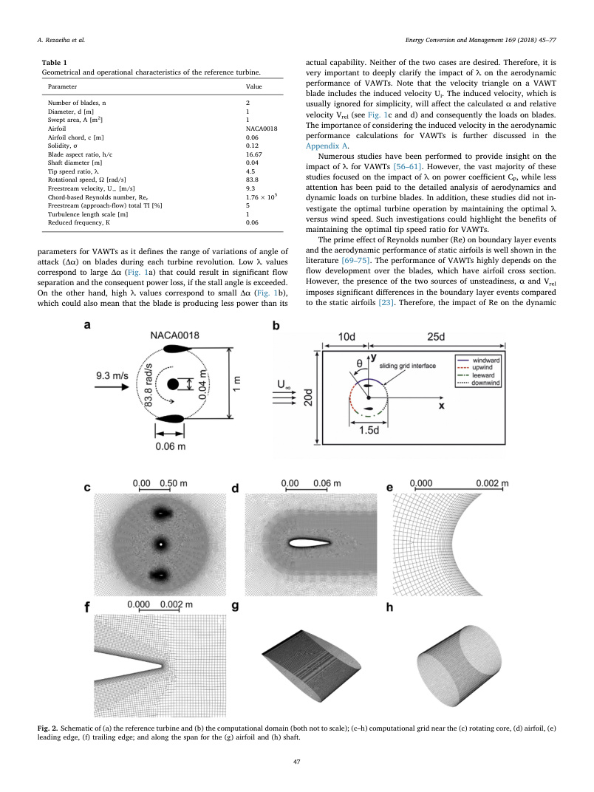

# va31 Summary

This study uses validated two-dimensional URANS to examine how tip-speed ratio, chord-based Reynolds number, and inflow turbulence intensity affect the blade loads, power, thrust, and wake of a two-bladed H-type VAWT. (source: sources/va31.md)

Original caption: Fig. 2. Schematic of (a) the reference turbine and (b) the computational domain (both not to scale); (c-h) computational grid near the rotating core, airfoil, leading edge, trailing edge, airfoil span, and shaft span. [[va31|Source]]

Key points:
- The reference rotor has two NACA0018 blades, `D = 1 m`, `H = 1 m`, `c = 0.06 m`, solidity `0.12`, and a `0.04 m` shaft. Its reference operation is `U_infinity = 9.3 m/s`, `TSR = 4.5`, `Omega = 83.8 rad/s`, chord Reynolds number `1.76 x 10^5`, and approach-flow turbulence intensity `5%`. (source: sources/va31.md)
- The model is a 2D mid-plane URANS sliding-grid case using transition SST, approximately `400,000` quadrilateral cells, and near-wall resolution with average/max blade `y+` of `1.8/3.8`. (source: sources/va31.md)
- At fixed chord Reynolds number near `2.0 x 10^5`, the highest reported power coefficient occurs at `TSR = 4.0`; lower `TSR` increases angle-of-attack variation and causes dynamic stall and blade-wake interactions. (source: sources/va31.md)
- Across the examined range, increasing chord Reynolds number improves power coefficient, increases peak lift and delays separation, while reducing drag especially in the aft half of the revolution. (source: sources/va31.md)
- Turbulence intensity has a conditional effect: it delays stall and improves the dynamic-stall case at `TSR = 2.5`, but excessive turbulence reduces power at the optimal `TSR = 4.0` through increased skin-friction drag. (source: sources/va31.md)
- The authors report near-wake velocity validation for the reference-like turbine and a separate power-coefficient comparison against a different three-bladed NACA0021 turbine. Those comparisons do not directly validate every operational case in this paper. (source: sources/va31.md)

Related pages: [[va31 Reference H-Type VAWT]], [[va31 Operational Effects on H-VAWT CFD]], [[H-VAWT]], [[Reynolds Number]], [[Dynamic Stall]].
