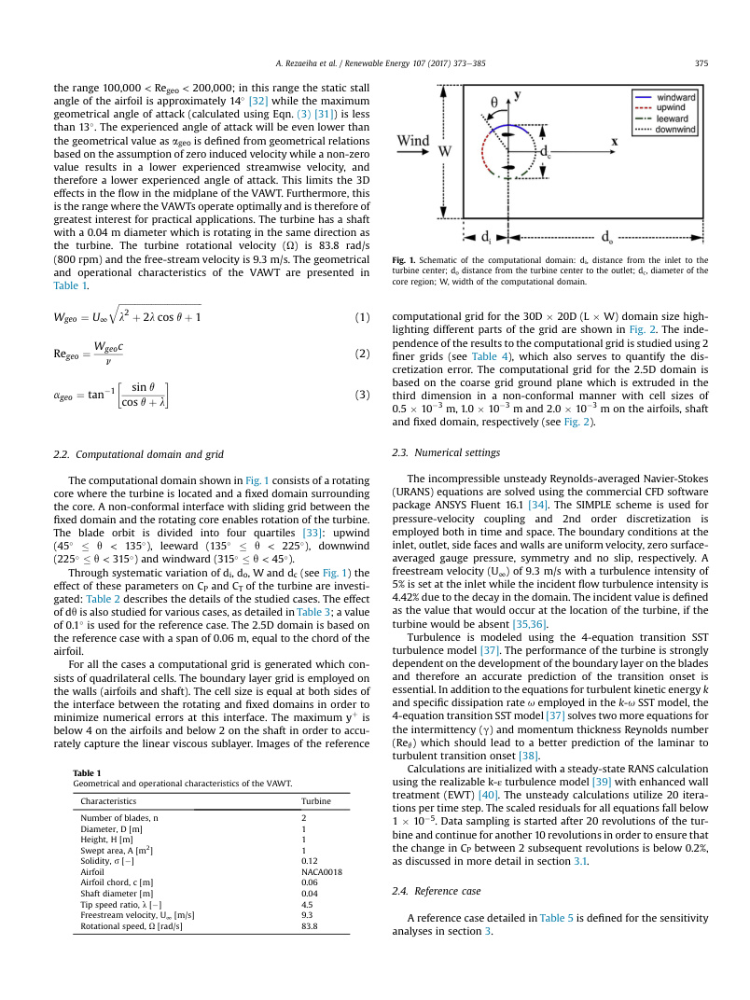

# va33 Summary

This paper validates and sensitivity-tests a two-bladed NACA0018 H-VAWT at moderate `TSR = 4.5`, concentrating on domain size, azimuthal increment, grid dependence, and transient convergence in 2D and 2.5D URANS. (source: sources/va33.md)

Original caption: Fig. 1. Schematic of the computational domain: `d_i`, distance from the inlet to the turbine center; `d_o`, distance from the turbine center to the outlet; `d_c`, diameter of the core region; `W`, width of the computational domain. [[va33|Source]]

Key points:
- The reference H-rotor has two NACA0018 blades, `D = 1 m`, `H = 1 m`, `c = 0.06 m`, solidity `0.12`, a `0.04 m` shaft, `TSR = 4.5`, and `U_infinity = 9.3 m/s`. (source: sources/va33.md)
- The selected 2D setup uses `395,851` cells, transition SST, `0.1 degrees` azimuthal increment, `30` revolutions, a `30D x 20D` domain, and a `1.5D` rotating core. (source: sources/va33.md)
- Grid refinement changes the reported `Cp` only from `0.410` to `0.413`; the paper therefore uses the coarse grid for its sensitivity study. (source: sources/va33.md)
- The calculated `Cp` is approximately `0.41`, within `2.5%` of the cited experiment's `0.40`. Its lateral near-wake velocity errors are below `3%`, while streamwise errors span about `8-16%`. (source: sources/va33.md)
- For this one moderately loaded case, the study identifies `10D` from rotor center to both inlet and outlet, `20D` width, `1.5D` rotating core, `0.5 degrees` azimuthal increment, and `20-30` revolutions as safe starting settings. (source: sources/va33.md)

> Uncertainty: the later broader parameter study in [[va32 VAWT URANS Computational Guidelines]] uses `15D` upstream to keep its isolated inlet-boundary influence below `1%` across additional tip-speed-ratio and solidity cases. Treat `10D` as the narrower `va33` result, not as the general choice. (source: sources/va33.md, sources/va32.md)

Related pages: [[va33 Moderate-TSR Reference H-Type VAWT]], [[va32 VAWT URANS Computational Guidelines]], [[SimScale VAWT CFD Learning Path]].
