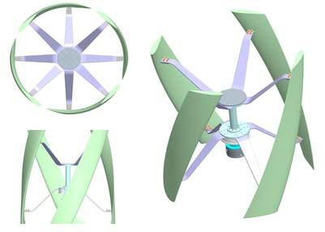
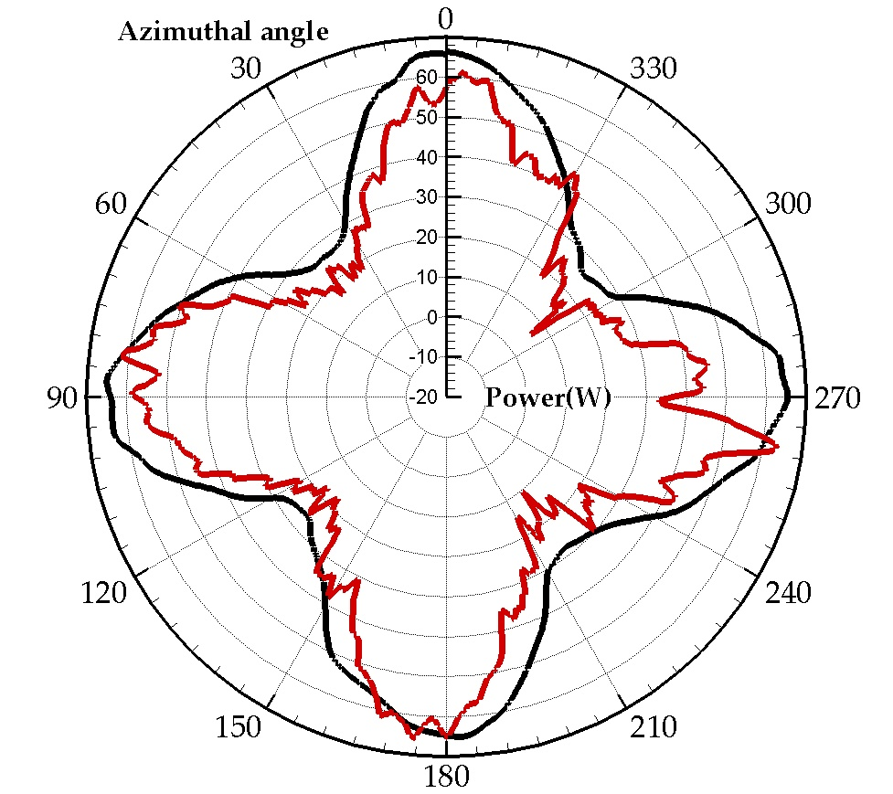

## va4 Source Summary

Summary of `sources/va4.md`. (source: sources/va4.md)

- The paper studies a four-bladed helical VAWT with LES and U-RANS. (source: sources/va4.md)
- The main outputs are power coefficient, torque fluctuation, angle of attack, and flow-field structure. (source: sources/va4.md)
- Peak performance occurs near TSR 1.8 for the tested case. (source: sources/va4.md)
- The helical layout smooths total power output, but 3D effects still reduce performance. (source: sources/va4.md)
- Tip vortex, second flow, and blade-wake interaction are identified as key loss mechanisms. (source: sources/va4.md)

## Figures

Related concepts: [[Helical VAWT]], [[VAWT]], [[Darrieus Turbine]], [[Dynamic Stall]], [[CFD]]
