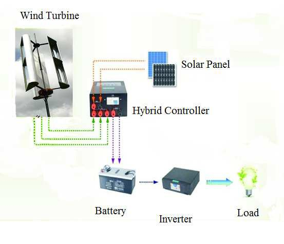

## va5 Source Summary

Summary of `sources/va5.md`. (source: sources/va5.md)

- The paper designs a compact rooftop VAWT for low-cost rural electrification. (source: sources/va5.md)
- It chooses a three-bladed J-type drag rotor because of simplicity and low-cost construction. (source: sources/va5.md)
- The design target is 35 W, with 1 m rotor diameter and 1 m swept height. (source: sources/va5.md)
- The prototype is reported at 23.3% efficiency, below the planned 25% because of fabrication and friction losses. (source: sources/va5.md)

## Figures

Original caption: Fig 1: Configurations for shaft and rotor orientation [[va5|Source]]

Original caption: Fig. 4: Block Diagram [[va5|Source]]

Related concepts: [[va5 J-Type VAWT|J-Type VAWT]], [[VAWT]], [[Savonius Turbine]], [[Wind Turbine Parameters]]

#summaries
