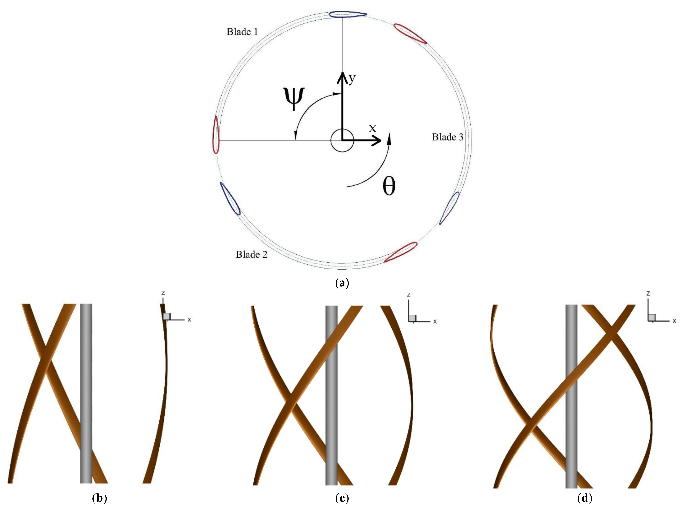
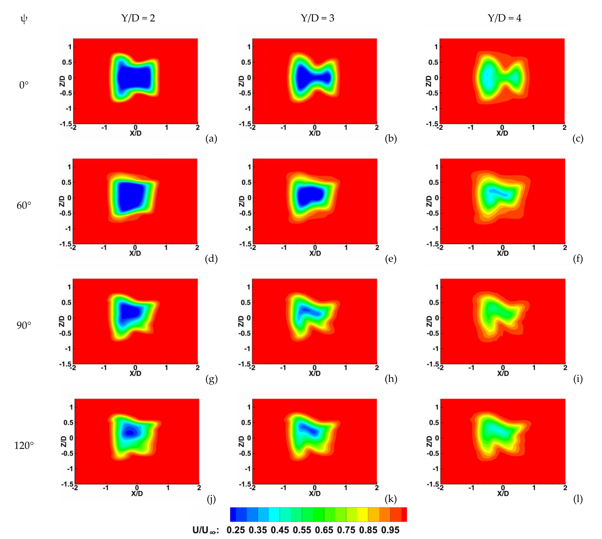

## va7 Source Summary

Summary of `sources/va7.md`. (source: sources/va7.md)

The paper studies how helix angle affects the aerodynamic performance of helical vertical-axis wind turbines using 3D CFD in Ansys FLUENT. (source: sources/va7.md)

Key points:
- The study compares straight blades with helical blades at 60, 90, and 120 degrees across multiple tip speed ratios. (source: sources/va7.md)
- The model uses a helically extruded NACA0015 blade, a central shaft, a 3 m turbine height, 10 m/s inlet velocity, and a transition SST k-omega turbulence model. (source: sources/va7.md)
- The CFD setup uses stationary and rotating domains, a sliding mesh interface, second-order schemes, cyclic convergence checks, grid/time-step independence checks, and validation against McLaren's experimental VAWT data. (source: sources/va7.md)
- The 60-degree helical blade produced the highest reported performance among the compared straight and helical cases, with peak performance at TSR 3.3. (source: sources/va7.md)
- Increasing helix angle reduced the standard deviation of power coefficient, meaning the 120-degree helical blade had smoother cyclic loading than the straight blade, even though it performed worse in power. (source: sources/va7.md)
- The section-wise blade analysis found that leading, mid, and trailing sections contribute different amounts to moment coefficient and that z-vorticity contours explain secondary peaks and flow separation. (source: sources/va7.md)
- Wake analysis found that wakes dissipate more quickly for non-straight blade VAWTs, with weaker wake profiles as helix angle increases. (source: sources/va7.md)

## Figures

Related concepts: [[Helical VAWT]], [[VAWT]], [[Wind Turbine Parameters]], [[CFD]]
