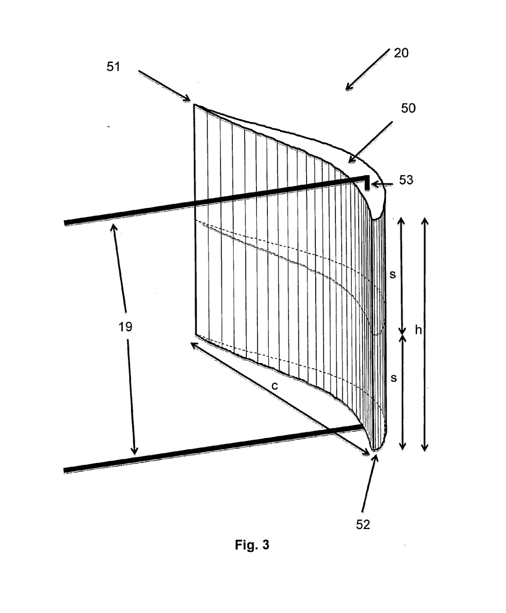

## va8 Source Summary

Summary of `sources/va8.md`. (source: sources/va8.md)

This patent application describes a hybrid vertical-axis wind turbine that combines lift-producing asymmetrical blades with drag-producing horizontal channel beams containing compartments. (source: sources/va8.md)

Key points:
- The proposed turbine uses a central vertical rotating shaft, upper and lower hubs, upper and lower channel-shaped horizontal beams, multiple blades, thrust bearings, permanent magnets, a copper-wire coil, and a battery or grid connection for power collection. (source: sources/va8.md)
- The hybrid mechanism is not an inner Savonius rotor inside an outer Darrieus rotor; instead, the channel beams with compartments are described as acting similar to a Savonius VAWT while the asymmetrical blades generate lift. (source: sources/va8.md)
- The blade profile is described as simple, asymmetric, and having unequal upper and lower cambers, with path difference between upper and lower surfaces equal to 20% of chord length, path difference between chord line and bottom surface equal to 3% of chord length, and maximum-thickness-to-chord ratio equal to 11.5%. (source: sources/va8.md)
- The patent says the blade-to-horizontal-beam angle is fixed at 25 degrees and presents wind tunnel observations where lift coefficient peaks around a 25-degree angle of attack for wind from either the leading or trailing edge direction. (source: sources/va8.md)
- The source reports that, compared with a typical flat-bottom profile, the proposed profile has a lower maximum-thickness-to-chord ratio, a smaller area under the thickness-ratio curve, and is 54% lighter. (source: sources/va8.md)
- The example claims the proposed profile produces 2.5 times the net circumferential force of a typical flat-bottom profile, but this is a patent example based on the source's wind tunnel setup and should not be treated as a general validated trend without corroboration. (source: sources/va8.md)
- The design places power generation and storage components at the bottom of the turbine to improve stability. (source: sources/va8.md)

## Figures

Related concepts: [[../concepts/Hybrid VAWT]], [[../concepts/Aerodynamic Design Parameters]], [[../concepts/Structures and Loads]], [[../concepts/Materials and Manufacturing]], [[../concepts/Urban Wind Conditions]], [[../methods/Wind Tunnel Testing]]
