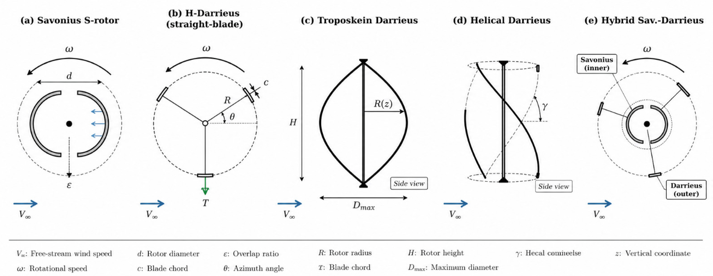
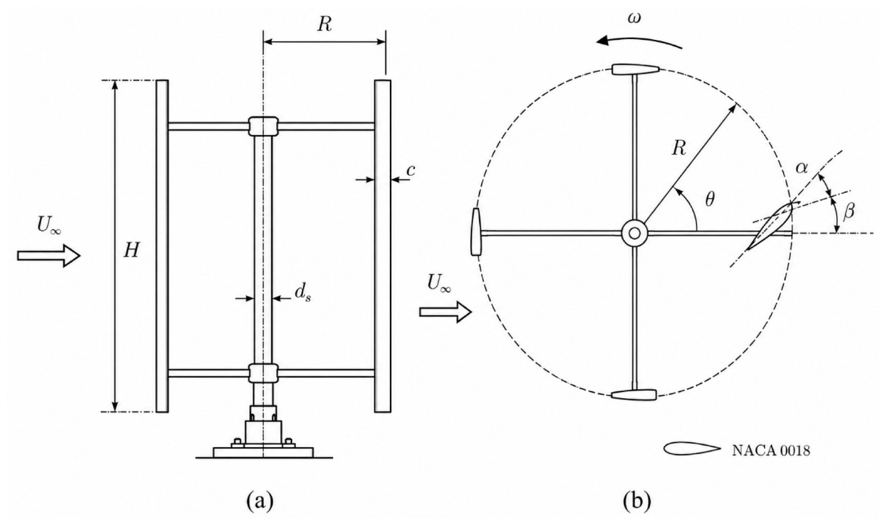
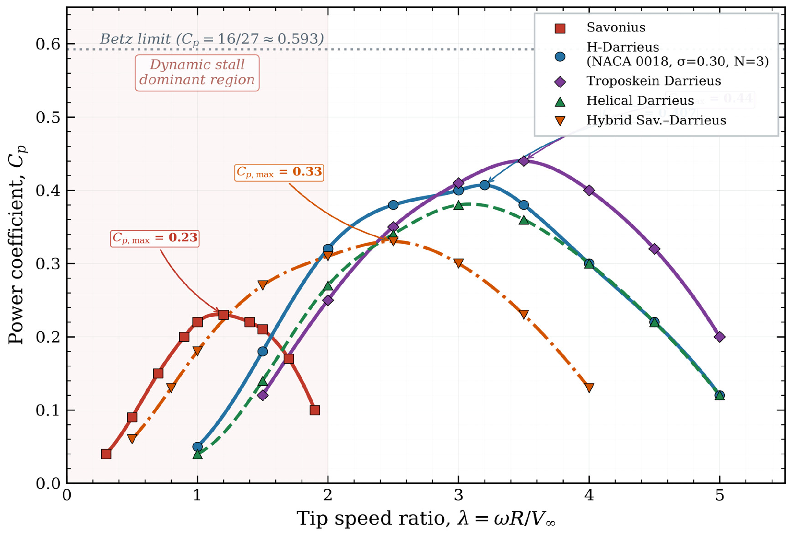
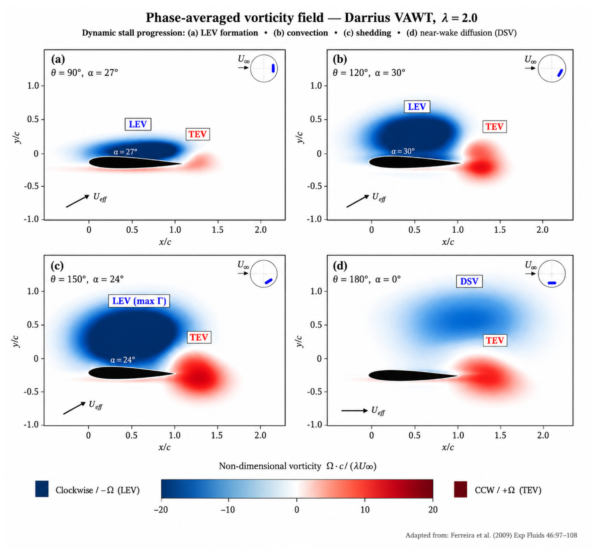
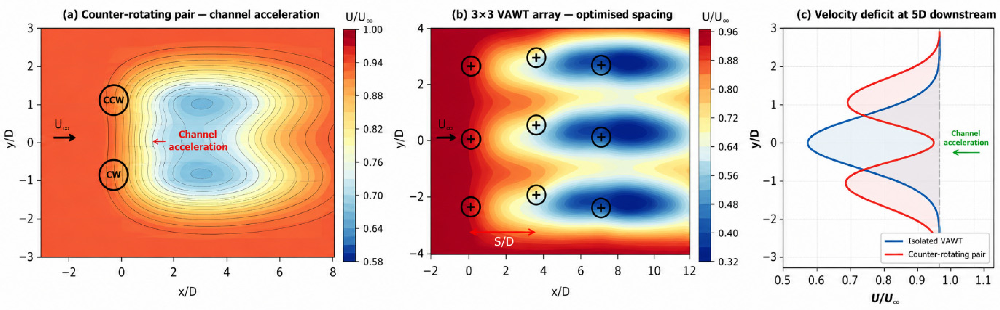

## vj11 Summary

This review synthesizes VAWT aerodynamic theory, rotor configurations, performance trends, numerical methods, experiments, and optimization strategies. (source: sources/vj11.md)

- The paper organizes VAWTs into drag-driven, lift-driven, and hybrid families, then compares Savonius, H-Darrieus, troposkein, helical, and hybrid configurations. (source: sources/vj11.md)
- It treats tip speed ratio, solidity, Reynolds number, blade profile, pitch angle, and blade count as the main design variables governing performance. (source: sources/vj11.md)
- It identifies dynamic stall, leading-edge vortex shedding, and blade-wake interaction as the key unsteady effects behind low-TSR performance loss. (source: sources/vj11.md)
- It says URANS with `k-ω SST` is the main design-stage CFD tool, while transition SST and DES/LES are preferred when dynamic stall fidelity matters more. (source: sources/vj11.md)
- It reports that H-Darrieus rotors achieve the highest peak `Cp`, Savonius rotors self-start best, and hybrids/helical rotors trade efficiency for better startup or smoother torque. (source: sources/vj11.md)
- It highlights that field and wind-tunnel results show strong Reynolds-number and turbulence-intensity sensitivity, especially for urban rooftop deployment. (source: sources/vj11.md)
- It concludes that no single enhancement strategy dominates; the most useful gains come from multi-objective optimization across self-starting, ripple, loading, and site conditions. (source: sources/vj11.md)

Figures:
- 
  Original caption: Figure 1: Schematic representation of major VAWT configurations [[vj11|Source]]
- 
  Original caption: Figure 2: Geometric configuration and parameter definition of the straight-bladed Darrieus H-rotor vertical axis wind turbine (VAWT) [[vj11|Source]]
- 
  Original caption: Figure 3: Representative Cp?? characteristics for the principal VAWT configurations [[vj11|Source]]
- 
  Original caption: Figure 4: Phase-averaged vorticity field illustrating the dynamic stall process on a Darrieus blade at TSR = 2.0 [[vj11|Source]]
- 
  Original caption: Figure 5: Array wake and channel acceleration effects in VAWT clusters [[vj11|Source]]

Related pages: [[VAWT]], [[VAWT Types]], [[Savonius Turbine]], [[Darrieus Turbine]], [[Hybrid VAWT]], [[Helical VAWT]], [[Wind Turbine Parameters]], [[Dynamic Stall]], [[CFD]], [[Wind Tunnel Testing]], [[Urban Wind Conditions]], [[Scaling Effects]], [[Optimization]]

#summaries
