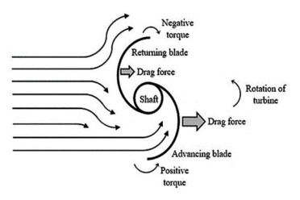
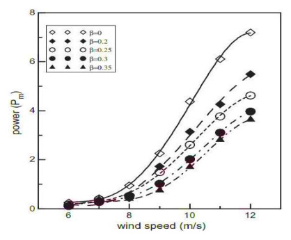

## vj12 Summary

This review argues that VAWT performance gains come from two broad paths: active rotor changes and passive flow-guiding devices. (source: sources/vj12.md)

- Active methods include counter-rotating rotors, blade-shape changes, twist, multi-stage stacks, inner blades, and end plates. (source: sources/vj12.md)
- Passive methods include guide vanes, airfoil deflectors, and diffuser-like layouts that redirect flow toward the rotor. (source: sources/vj12.md)
- The paper treats overlap ratio, aspect ratio, blade count, TSR, Reynolds number, and blade profile as key design variables. (source: sources/vj12.md)
- It says Savonius and contra-rotating VAWT concepts are especially important when self-starting and low-speed operation matter. (source: sources/vj12.md)
- It also emphasizes that siting matters: terrain, turbulence, obstacle clearance, and wind-farm spacing can materially change performance. (source: sources/vj12.md)

Figures:
- Figure 1: 
- Figure 7: 
- Figure 21: 
- Figure 27: 
- Figure 28: 

Related pages: [[VAWT]], [[Contra-rotating VAWT]], [[Savonius Turbine]], [[Urban Wind Conditions]], [[Wind Shear]], [[Optimization]], [[Wind Turbine Parameters]], [[Design Checklist]]

#summaries
