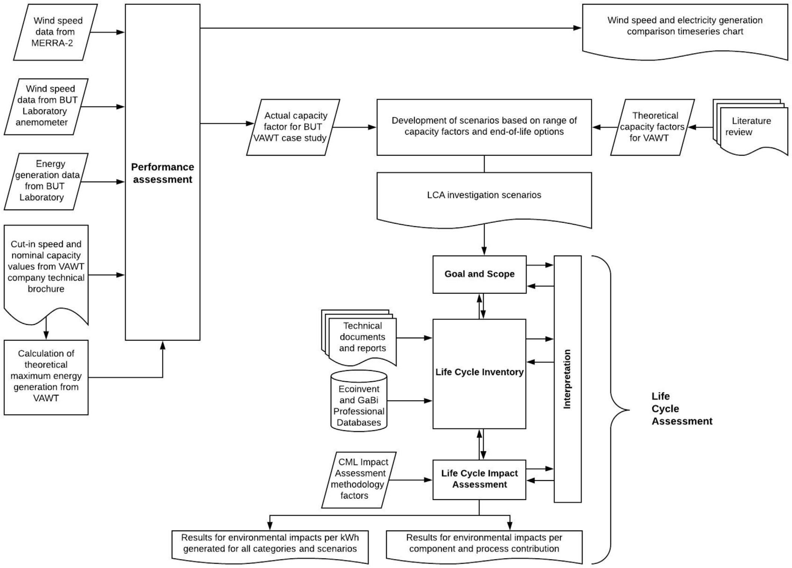
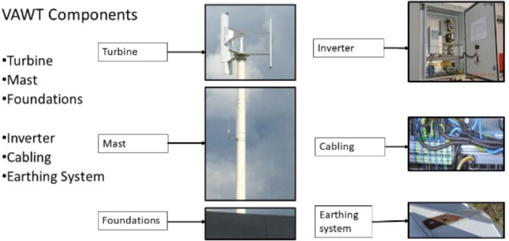
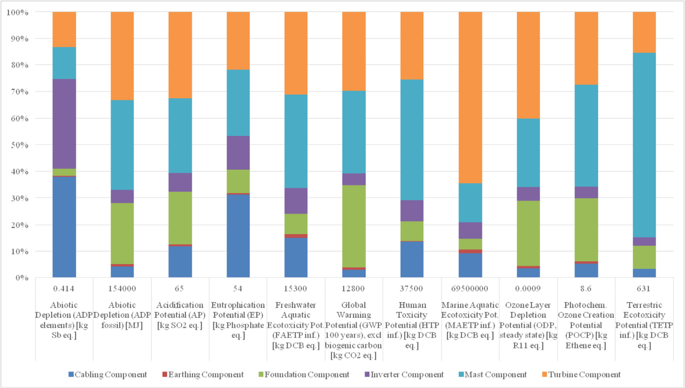

## vj14 Summary

This paper evaluates a specific 5 kW H-Darrieus VAWT at a real campus site and uses its measured generation data in a cradle-to-grave LCA. (source: sources/vj14.md)

- The actual annual generation was only 219.4 kWh, corresponding to a 0.50% capacity factor over the 3-year monitoring period. (source: sources/vj14.md)
- The paper says low local wind speed is the main reason for the poor performance. (source: sources/vj14.md)
- It finds that the mast and foundation dominate most environmental impacts, especially GWP. (source: sources/vj14.md)
- A feasible capacity factor of 1.4% would be enough to make GWP lower than the Polish low-voltage electricity mix. (source: sources/vj14.md)
- The source recommends better siting, recycling metals, and roof mounting instead of a steel mast and concrete foundation where possible. (source: sources/vj14.md)

Figures:
- 
  Original caption: Fig. 1. Research methodology flowchart. [[vj14|Source]]
- 
  Original caption: Fig. 2. Main components of the Windkop 5 kW Vertical Axis Wind Turbine system. [[vj14|Source]]
- 
  Original caption: Fig. 8. Life Cycle environmental impacts of the VAWT per component. [[vj14|Source]]

Related pages: [[Windkop 5 kW H-Darrieus VAWT]], [[Life Cycle Assessment]], [[Capacity Factor]], [[Economic Viability of VAWTs]], [[Urban Wind Conditions]], [[Wind Turbine Parameters]]

#summaries
