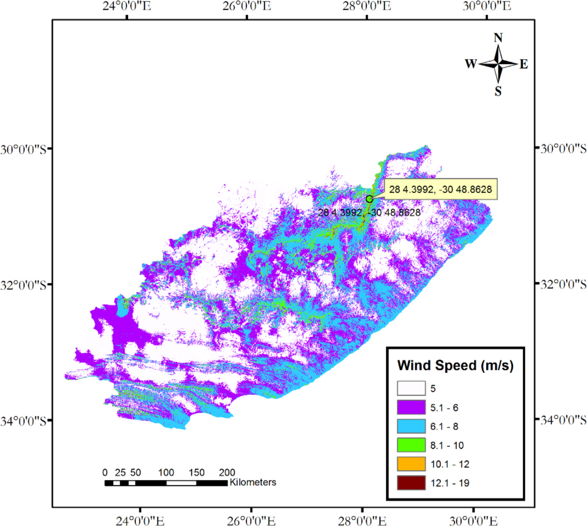

## vj16 Summary

This paper compares grid partitioning, subtractive clustering, and fuzzy c-means inside standalone ANFIS and PSO-ANFIS wind-power forecasting models. (source: sources/vj16.md)

- The study uses a synthetic wind-turbine gross power series for Eastern Cape, South Africa. (source: sources/vj16.md)
- Subtractive clustering performs best in both standalone and hybrid ANFIS runs. (source: sources/vj16.md)
- The PSO hybrid improves accuracy but increases computational time. (source: sources/vj16.md)
- The paper recommends subtractive clustering for ANFIS modeling in this case. (source: sources/vj16.md)

Related pages: [[PSO-ANFIS Forecasting]], [[Wind Turbine Parameters]]

Original caption: Fig. 4. Wind speed distribution of Eastern Cape Province, South Africa. The location with a placemark is where the data was collected. [[vj16|Source]]

#summaries
