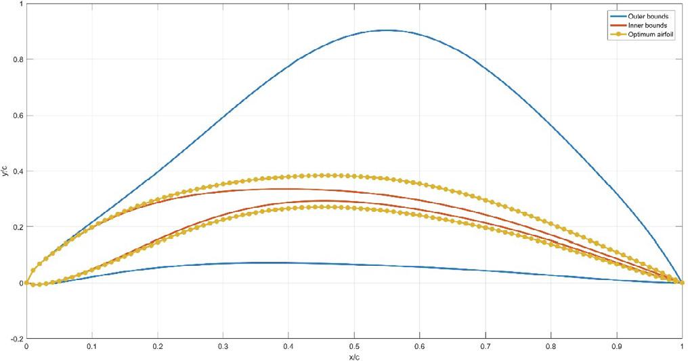

## vj17 Summary

This paper optimizes an airfoil-based Savonius wind turbine by coupling DVM, CST, and SSA. (source: sources/vj17.md)

- The optimized airfoil geometry gives about a 27 percent Cp improvement over the semicircular baseline. (source: sources/vj17.md)
- The optimization is run at TSR 0.4 and 7 m/s free-stream velocity. (source: sources/vj17.md)
- The paper verifies the DVM result and then checks the final geometry with CFD. (source: sources/vj17.md)
- The best geometry is selected by maximizing Cp over eight CST curvature variables. (source: sources/vj17.md)

Related pages: [[Savonius Turbine]], [[Optimization]], [[Discrete Vortex Method]], [[Salp Swarm Algorithm]], [[CST Parameterization]], [[vj17 Airfoil-Based Savonius Wind Turbine]]

Original caption: Fig. 5. The achieved optimum geometry coordinates. [[vj17|Source]]

#summaries
