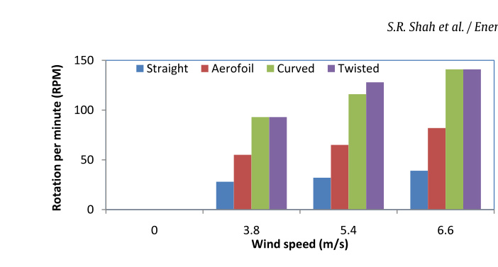
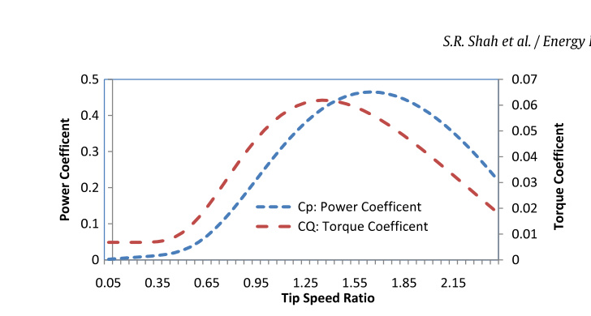

## vj19 Summary

This paper designs a small-scale Savonius-type VAWT, compares four blade shapes experimentally by RPM, and then models the selected curved-blade turbine with a MATLAB/Simulink performance and economics workflow. (source: sources/vj19.md)

- The tested blade shapes are curved, straight, aerofoil, and twisted; straight is the weakest in RPM, twisted is the best, and curved is close enough to twisted that the later modeling work focuses on the curved design. (source: sources/vj19.md)
- The built turbine uses three galvanized-steel blades attached at `120` degree spacing, with `0.8 m` blade width, `1.3 m` blade height, and `1.5 m` total height. (source: sources/vj19.md)
- The model splits performance into aerodynamic `Cp`, mechanical power/torque, and electrical generator losses, then uses a wind-speed distribution table to estimate annual output. (source: sources/vj19.md)
- The paper reports `7838 kWh` annual energy output, `846.51 USD/year` revenue at `0.108 USD/kWh`, `3 m/s` cut-in speed, `17 m/s` cut-out speed, and a simple-payback estimate of `3.5 years` when total system cost is assumed to be `3000 USD`. (source: sources/vj19.md)
- The source also reports peak modeled `Cp` up to `0.46` as TSR varies from `0.05` to `2.5`, with the text identifying `1.65` as the threshold between under-speed and over-speed behavior. (source: sources/vj19.md)

> Uncertainty: the paper says the turbine reaches rated power at `9 m/s`, but the Table 2 electrical-power column keeps increasing above `9 m/s`, so the exact rated-power value is not source-clear. (source: sources/vj19.md)

Related pages: [[Savonius Turbine]], [[Annual Energy Output]], [[AEO Calculation]], [[Payback Period Analysis]], [[Wind Turbine Parameters]], [[vj19 Curved-Blade Savonius VAWT]], [[vj19 Savonius Blade Shape]]

Original caption: Fig. 3. Variation of RPM with air velocity for the tested blades. (The Figure was recreated from the source data with permission, Shah, 2014; Kumar et al., 2018). [[vj19|Source]]

Original caption: Fig. 7. Variation of power and torque coefficients vs. TSR. [[vj19|Source]]

#summaries
