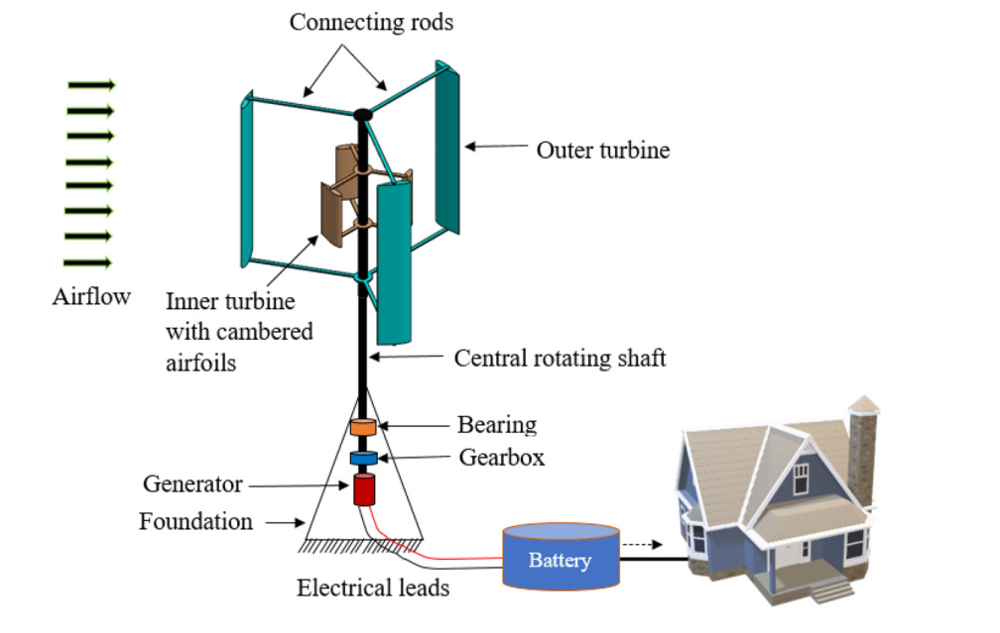
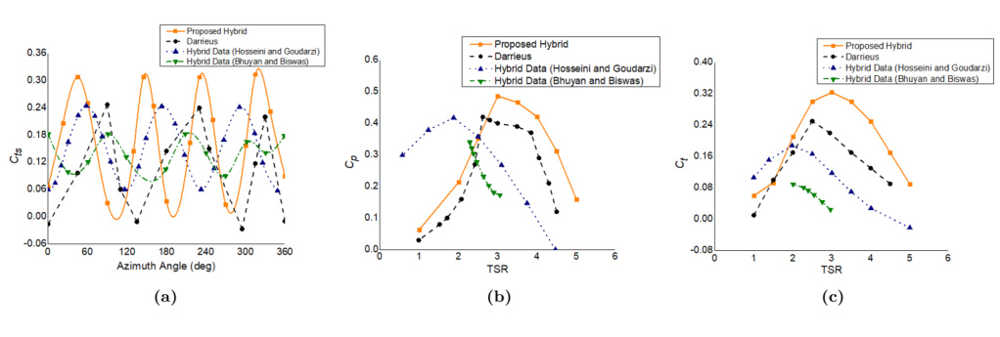

## vj20 Summary

This paper proposes a hybrid VAWT that replaces the usual inner Savonius rotor with an inner asymmetric-airfoil H-rotor, then evaluates it with similarity-based scaling, wind-tunnel testing, and CFD. (source: sources/vj20.md)

- The proposed turbine uses three outer `NACA0018` blades and three inner `DU 06-W-200` blades, with the inner rotor offset `60` degrees from the outer one. (source: sources/vj20.md)
- The paper reports a peak `Cp` of `0.486` at `TSR = 3` for the proposed hybrid, compared with `0.42` for the compared H-rotor Darrieus and `0.41` for the cited existing hybrid benchmark. (source: sources/vj20.md)
- It argues the main gain is self-starting plus efficiency together: the proposed hybrid keeps positive `Cts` at all azimuths while outperforming the comparison cases by about `11%-13%` in `Cp`, `Ct`, `Cts`, and output power across the tested range. (source: sources/vj20.md)
- The experimental roughness study finds rough blades help at low wind speed and low Reynolds number, while smoother blades perform better above about `3 m/s`. (source: sources/vj20.md)
- The source also uses a scaled-down model and reports that the experimental and computational results stay within about `2%-3%` of the full-scale similarity prediction. (source: sources/vj20.md)

> Uncertainty: the paper gives several cut-in-style values depending on context, including `1.72 m/s` in the experimental section, `1.54 m/s` in later comparison figures, and `1.405 m/s` / `2.81 m/s` in the scaled/full-scale similarity table. These should be treated as source-internal variants rather than one single uncontested cut-in number. (source: sources/vj20.md)

Related pages: [[Hybrid VAWT]], [[Scaling Effects]], [[CFD]], [[Wind Tunnel Testing]], [[Optimization]], [[Box-Behnken Design]], [[vj20 Proposed Hybrid VAWT]], [[vj20 Blade Surface Roughness]]

Original caption: Figure 1. Conceptual model and operating principle of the hybrid wind turbine under consideration. Wind's kinetic energy is transformed into electricity using a hybrid vertical axis wind turbine (VAWT) with asymmetric (inner side) and symmetric (outer side) airfoil blades that can be employed via an energy storage device. [[vj20|Source]]

Original caption: Figure 16. (a) Static torque coefficient (Cts) versus azimuth of the proposed hybrid VAWT, H-rotor Darrieus, and existing hybrid wind turbines. According to the illustration, hybrid VAWTs provide positive Cts values at all azimuths. The H-rotor Darrieus turbine, on the other hand, exhibits negative Cts values in the regimes of theta = 129 degrees-140 degrees, 278 degrees-300 degrees, and 348 degrees-10 degrees. The proposed hybrid wind turbine has a higher maximum Cts value (0.309) than the subsisting hybrid wind turbine (0.218 and 0.245). (b) The variation of Cp versus TSR shows that for the proposed hybrid design, the maximum Cp was recorded as 0.486 at a TSR of 3, followed by 0.42 at a TSR of 2.62 for the H-rotor Darrieus, 0.34 and 0.41 at TSR of 2.29 and 2.5, respectively, for existing hybrid wind turbines. (c) The comparison of Ct versus TSR indicates that the proposed hybrid wind turbine has Ct of 0.324 at a TSR of 3, which is larger than that of an H-rotor Darrieus (0.25 at a TSR of 2.5) and existing hybrid wind turbines. [[vj20|Source]]

#summaries
