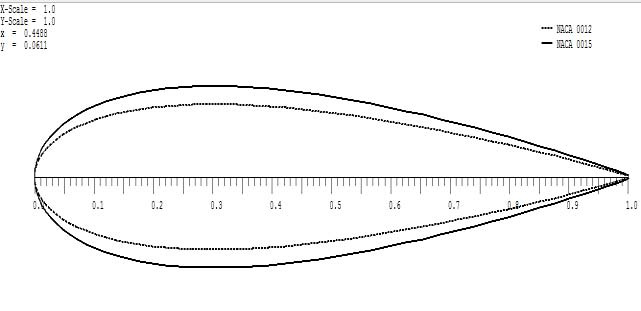
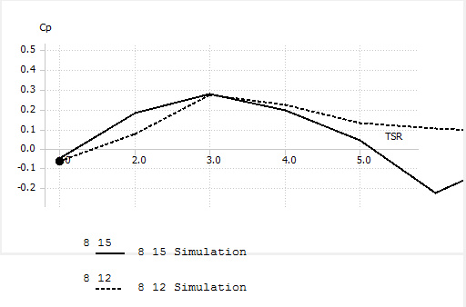

## vj22 Summary

This paper uses QBlade simulations to compare `NACA 0012` and `NACA 0015` for a small straight-bladed VAWT intended for low-wind-speed use, then studies how blade count changes `Cp`, `TSR`, and torque. (source: sources/vj22.md)

- The source studies low wind speeds from `2` to `8 m/s` and a simulated rotor with `0.66 m` height, `0.167 m` chord, and `1.00 m` blade radius. (source: sources/vj22.md)
- It reports that `NACA 0015` generally has the better low-Re lift-to-drag behavior and higher output power at higher wind speed than `NACA 0012`. (source: sources/vj22.md)
- For the blade-count sweep, the paper says `3` blades give the highest and most stable `Cp`, while `5` and `8` blades give lower `Cp` but more torque and better self-starting behavior in low wind. (source: sources/vj22.md)
- The reported `TSRmax` values are `4.2` for `3` blades, `2.5` for `5` blades, and `1.6` for `8` blades. (source: sources/vj22.md)
- The paper frames the basic tradeoff clearly: low blade count improves efficiency, while higher blade count increases solidity, drag, and startup torque. (source: sources/vj22.md)

> Uncertainty: the source uses a simple simulated small-scale rotor and does not report experimental validation, so the claims here are simulation-specific rather than field-confirmed. (source: sources/vj22.md)

Related pages: [[Darrieus Turbine]], [[Straight-bladed Darrieus]], [[Wind Turbine Parameters]], [[VAWT Aerodynamic Design Parameters]], [[QBlade]], [[vj22 Simulated Small-Scale Straight-Bladed VAWT]], [[vj22 Blade Profile]], [[vj22 Blade Number]]

Original caption: Fig. 2. The comparison of shape of NACA 0012 and NACA0015 [[vj22|Source]]

Original caption: Fig. 12 Comparison of Cp against TSR of NACA 0015 for 3, 5 and 8 blades. [[vj22|Source]]

#summaries
