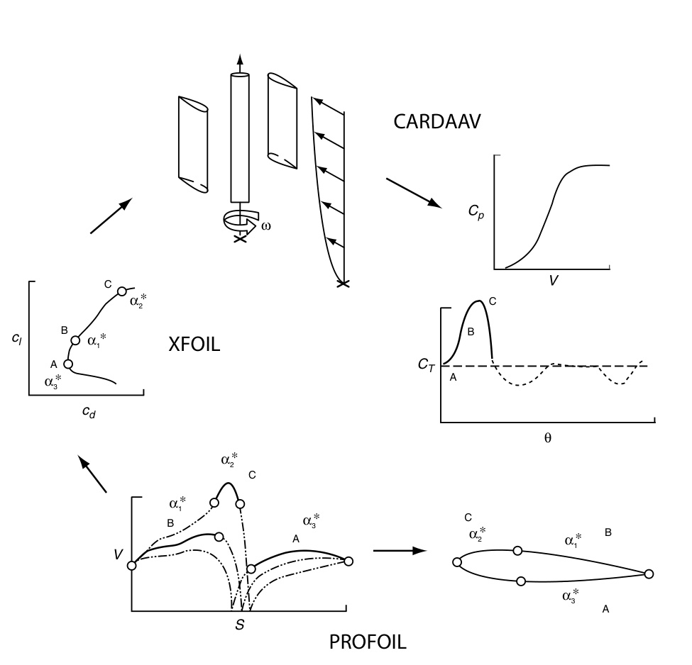
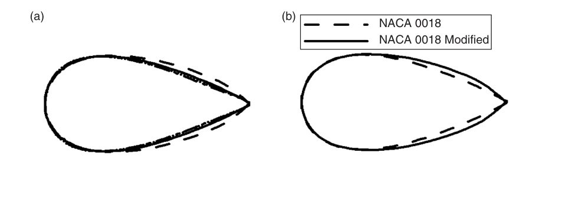

## vj24 Summary

This paper presents an inverse-airfoil-design workflow for improving a low-speed straight-bladed Darrieus VAWT, using a coupled `PROFOIL` + `XFOIL` + `CARDAAV` toolbox and one `3`-bladed example rotor. (source: sources/vj24.md)

- The paper argues that small straight-bladed Darrieus VAWTs are strongly limited by low-Reynolds-number airfoil behavior, especially laminar separation bubbles, transition behavior, and poor post-stall prediction. (source: sources/vj24.md)
- It frames inverse airfoil design as a way to prescribe desirable velocity-distribution behavior directly, rather than only testing candidate airfoils by repeated analysis. (source: sources/vj24.md)
- The design example uses a `3`-bladed straight-bladed rotor with `0.125 m` chord, `6 m` blade length, `6 m` rotor diameter, `12 m/s` wind speed, and `TSR = 1.6` operating target. (source: sources/vj24.md)
- The modified `NACA 0018-M` airfoil is reported to raise predicted power from `1.610 kW` to `1.850 kW` and `CP` from `0.294` to `0.338` relative to the `NACA 0018` XFOIL-plus-experiments case. (source: sources/vj24.md)
- The source says the key result should be treated as a relative `10-15%` performance gain, not as a fully trustworthy absolute prediction, because low-Re and high-angle-of-attack airfoil analysis remains a weakness. (source: sources/vj24.md)

Original caption: Figure 1: The inverse airfoil design strategy as employed for improved performance of a VAWT. [[vj24|Source]]

Original caption: Figure 3: (a) Evolution of the design. (b) Final design compared to the original NACA 0018 airfoil. (Note: the y-axis has been greatly exaggerated to highlight difference in the airfoil shapes). [[vj24|Source]]

Related pages: [[PROFOIL]], [[Double-Multiple Streamtube Model]], [[Straight-bladed Darrieus]], [[vj24 3-Bladed Straight-Bladed Darrieus VAWT]], [[vj24 Blade Airfoil]]

#summaries
