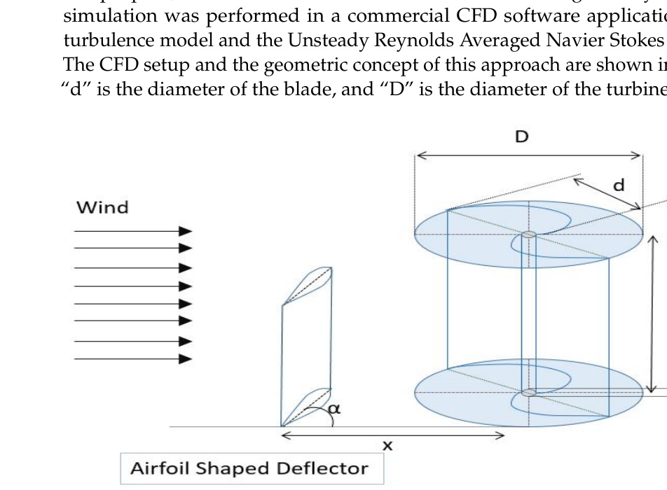
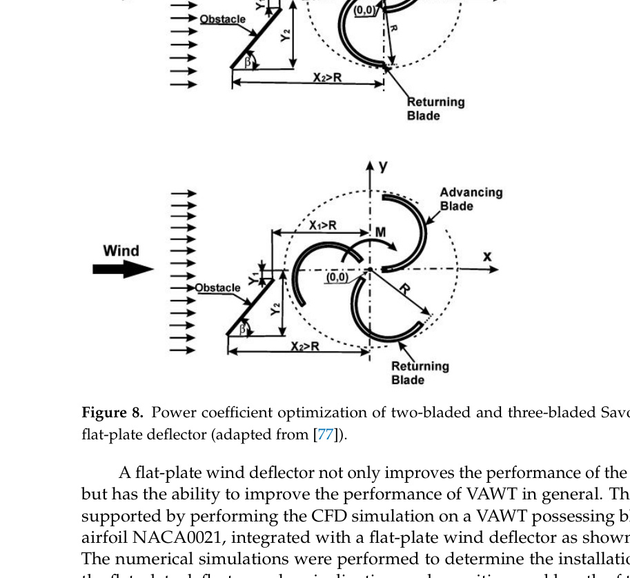
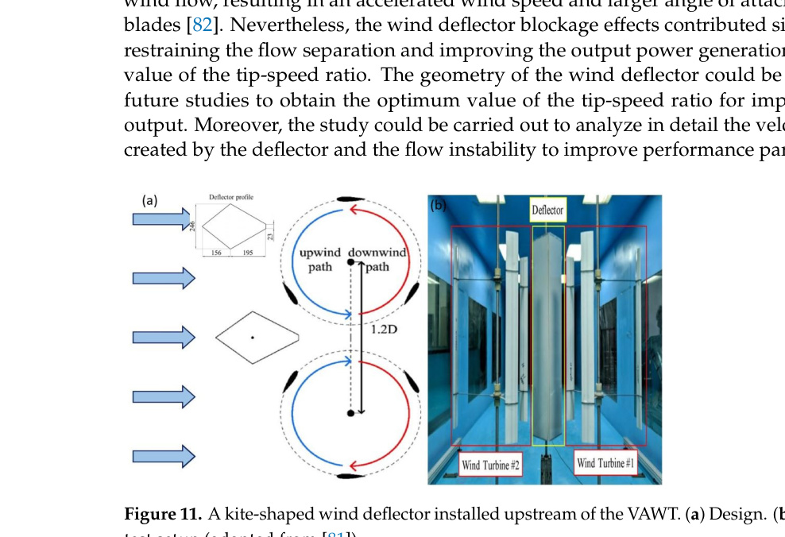

## vj27 Summary

This review focuses on wind deflectors as a passive flow-augmentation strategy for small VAWTs, especially Savonius and other urban-targeted rotors. (source: sources/vj27.md)

- The paper treats negative torque on the returning blade as the main VAWT problem that deflectors are meant to reduce. (source: sources/vj27.md)
- It organizes wind deflectors into flat-plate, airfoil-shaped, and compound structures, and says the key design variables are shape, installation position, orientation, and distance from the rotor. (source: sources/vj27.md)
- It reports representative gains of about `27.3%` for a two-bladed Savonius with a flat-plate deflector, `27.55%` for a three-bladed Savonius flat-plate case, `50%` for an airfoil-shaped Savonius deflector case, `47.1%` average torque-coefficient gain for one helical/lift-based flat-plate case, `26%` for a straight-blade twin-turbine flat-plate case, and `38.6%` for a kite-shaped twin-turbine deflector case. (source: sources/vj27.md)
- The review argues that deflectors are especially attractive because they can improve `Cp` without adding as much structural complexity as some other augmentation strategies. (source: sources/vj27.md)
- It also says reliability is still limited by the small number of real-time experimental validations compared with the much larger number of CFD studies. (source: sources/vj27.md)

Original caption: Figure 6. An airfoil-shaped wind deflector in the upstream of a Savonius rotor [75]. [[vj27|Source]]

Original caption: Figure 8. Power coefficient optimization of two-bladed and three-bladed Savonius turbine with flat-plate deflector (adapted from [77]). [[vj27|Source]]

Original caption: Figure 11. A kite-shaped wind deflector installed upstream of the VAWT. (a) Design. (b) Experimental test setup (adapted from [81]). [[vj27|Source]]

Related pages: [[Wind Deflector]], [[Wind Flow Modifier]], [[Savonius Turbine]], [[Optimization]], [[VAWT Aerodynamic Design Parameters|Aerodynamic Design Parameters]], [[CFD]], [[Wind Tunnel Testing]], [[vj27 Wind Deflector Shape]], [[vj27 Wind Deflector Position and Orientation]]

#summaries
