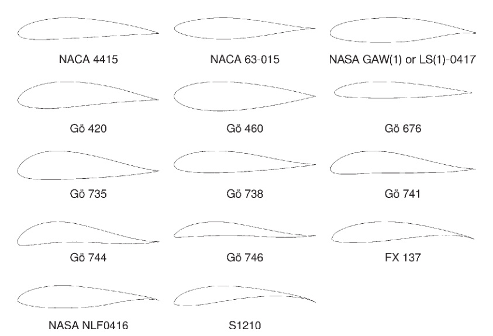

## vj28 Summary

This paper is a design-guidance and airfoil-screening study for smaller-capacity fixed-pitch straight-bladed Darrieus / SB-VAWT rotors, arguing that blade-section choice is central to both self-starting and overall aerodynamic performance. (source: sources/vj28.md)

- It frames small SB-VAWTs as operating in a difficult low-Reynolds-number regime where laminar separation bubbles, dynamic stall, flow-curvature effects, blade-wake interaction, parasitic strut drag, and turbulence all matter at once. (source: sources/vj28.md)
- It says the conventionally reused symmetric `NACA` 4-digit airfoils are not suitable for smaller-capacity SB-VAWTs, and recommends instead a high-lift, low-drag, asymmetric thick airfoil for low-speed operation. (source: sources/vj28.md)
- It identifies nine desirable aerodynamic characteristics for the blade section: large low-Re stall angle, wide drag bucket, low zero-lift drag, high `Cl/Cd`, high `Cl,max`, delayed deep stall, low roughness sensitivity, low trailing-edge noise, and large negative pitching moment. (source: sources/vj28.md)
- It reduces those targets to four desired geometric features: camber, greater thickness, large leading-edge radius, and sharp trailing edge. (source: sources/vj28.md)
- In the public-domain comparison, the paper does not find one complete winner: `S1210` leads several positive-incidence performance metrics, `NLF(1)-0416` has the widest low-Re drag bucket, `LS(1)-0417` is least roughness-sensitive in `Cdo`, and `NACA 4415` is the quietest in the `NAFNoise` comparison. (source: sources/vj28.md)
- It ends by calling for purpose-built low-Re SB-VAWT airfoils rather than naming a final best section, because the available candidates each miss some desired traits and several dedicated VAWT airfoils could not be fully assessed. (source: sources/vj28.md)

Original caption: Figure 8. Geometries of Selected Asymmetric Airfoils [[vj28|Source]]

Original caption: Figure 22. Geometric Features of a Typical Asymmetric Airfoil [[vj28|Source]]

> Uncertainty: the candidate-airfoil comparison is partly based on `XFOIL` plus `FoilCheck` / deep-stall extrapolation rather than a full unsteady rotating-blade validation campaign, and the nose-radius / deep-stall relation used in the paper comes from a much higher Reynolds number regime. (source: sources/vj28.md)

Related pages: [[Airfoil Selection for Small Straight-Bladed VAWTs]], [[Straight-bladed Darrieus]], [[H-VAWT]], [[XFOIL]], [[NAFNoise]], [[vj28 Blade Airfoil]]

#summaries
