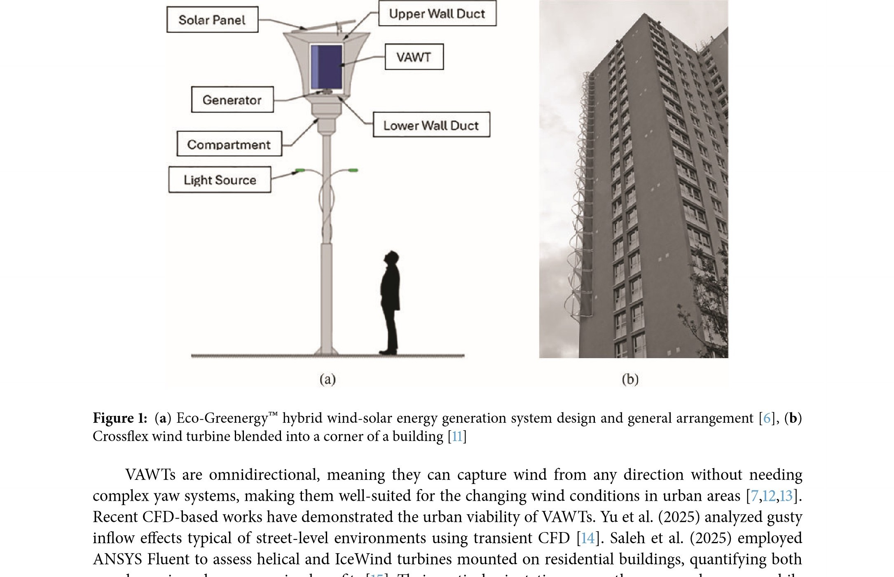
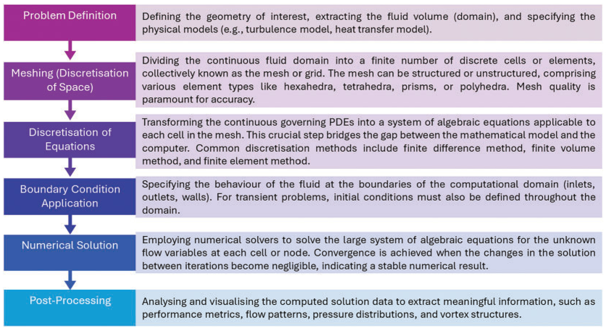
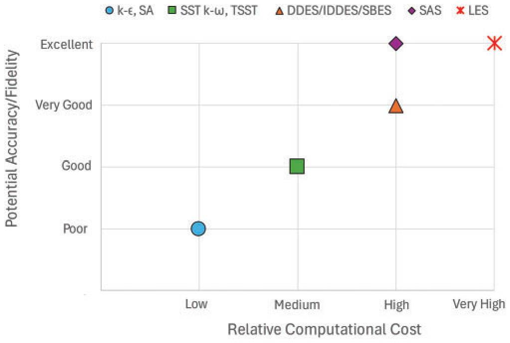
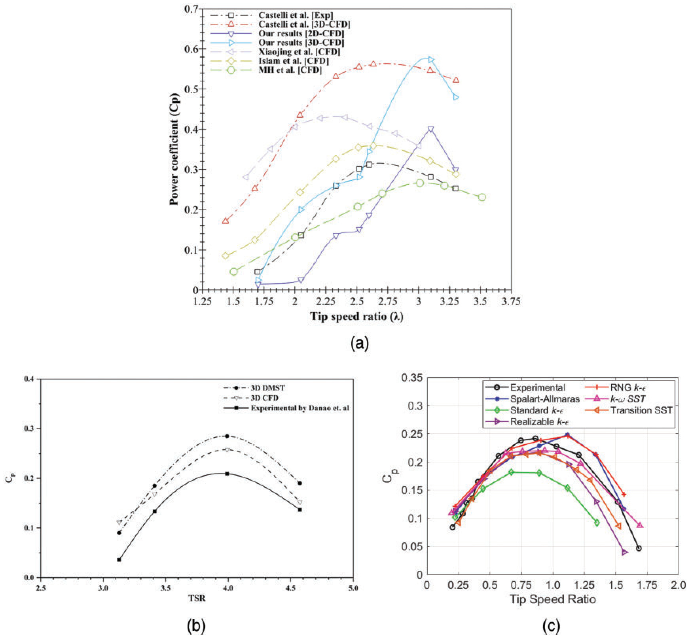

---
Created:
Updated: 2026-07-02
Sources: [[vj6]]
Source_count: 1
Tags:
- summaries
---

## vj6 Source Summary

Summary of `sources/vj6.md`. (source: sources/vj6.md)

Review of CFD techniques and methodologies used in VAWT development. (source: sources/vj6.md)

Original caption: Figure 1: (a) Eco-Greenergy™hybrid wind-solar energy generation system design and general arrangement [6], (b) [[vj6|Source]]

Original caption: Figure 2: A typical numerical framework consists of problem definition, meshing, discretisation of equations, [[vj6|Source]]

Original caption: Figure 13: Conceptual illustration of the Accuracy vs. Computational Cost trade-off for turbulence models in VAWT [[vj6|Source]]

Original caption: Figure 21: Examples of CFD validation for various VAWT types and CFD models. (a) URANS CFD validations for [[vj6|Source]]

Key points:
- VAWTs are attractive for urban use, but dynamic stall, blade-wake interaction, and changing angle of attack make CFD challenging. (source: sources/vj6.md)
- The review compares 2-D and 3-D simulations, static and dynamic meshing, turbulence models, and boundary-condition choices. (source: sources/vj6.md)
- 2-D CFD is useful for early study but tends to over-predict Darrieus performance; 3-D models capture tip losses and secondary flow better. (source: sources/vj6.md)
- Validation against experiments, especially wind tunnel and PIV data, is treated as essential. (source: sources/vj6.md)
- CFD is positioned as the detailed but expensive option between analytical models and physical testing. (source: sources/vj6.md)

#summaries
